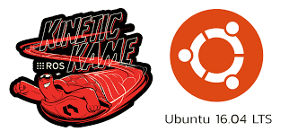

[](https://classroom.udacity.com/nanodegrees/nd209/dashboard/overview)

# Project 1 - Build My World

In this project, I created a Gazebo simulation of an office environment that goes by the name MyOfficeWorld.world. I also built a Gazebo model of a customized differential drive robot and equipped it with Gazebo plugins, for instance, hokuyo laser scanner and a RGB camera sensor. The project also teaches the student to insert plugins, which are nothing but C++ code snippets that interact with the Gazebo world file. This Gazebo world and the robot model was used for all subsequent projects.


## Table of Contents

   * [Requirements](#requirements)
   * [How to use](#how-to-use)
   * [Directory Structure](#directory-structure)
   * [Implementation](#implementation)
   * [Future Work](#future-work)
   * [License](#license)
   * [Contribution](#contribution)


### Requirements
1. Linux OS or a Virtual Machine on Windows/Mac platform, for eg. [Oracle VM VirtualBox](https://www.vmware.com/products/workstation-player/workstation-player-evaluation.html). This project has been developed on Ubuntu 16.04 desktop version of Linux OS using command line.

2. [ROS](http://wiki.ros.org/kinetic/Installation) kinetic version.

   
   
3. [C++](https://www.udacity.com/course/c-for-programmers--ud210)

4. [GitHub](https://www.udacity.com/course/version-control-with-git--ud123)

   
   
5. [Gazebo](http://gazebosim.org/) as the simulation environment.

   


### How to use
1. If you do not have an active ROS workspace, you can create one by following the below commands (assuming operating ROS kinetic version is already installed, if not follow these [instructions](http://wiki.ros.org/kinetic/Installation) -
```sh
$ mkdir -p ~/catkin_ws/src
$ cd ~/catkin_ws/
$ catkin_make
```

2. One time Gazebo setup step -
+ [Install](http://gazebosim.org/tutorials?tut=install_ubuntu&cat=install)
```sh
$ curl -sSL http://get.gazebosim.org | sh
```
+ Run
```sh
$ gazebo
```

3. Now that catkin_ws is setup locally on your machine, Clone this repository to your desired path using -
```sh
$ git clone https://github.com/SasmitC/ROS_Udacity_NanoDegree.git
$ cd ROS_Udacity_NanoDegree
```

4. Copy the contents from the 'Project2_Go_Chase_It/catkin_ws' directory, excluding the CMakeLists.txt and package.xml (delete these two files before building the project or modify the relative path directories in these two files), into your '~/catkin_ws' local src directory

5. Build the project using -
```sh
$ cd ~/catkin_ws
$ catkin_make
```

6. Add following to your .bashrc file, so that you do not need to source the environment while opening a new terminal window each time -
```sh
export GAZEBO_MODEL_PATH=~/catkin_ws/model/MyUdacityOffice
source ~/catkin_ws/devel/setup.bash
```

7. After building the project, launch the gazebo world file - 
```sh
$ cd ~/catkin_ws/world
$ gazebo MyOfficeWorld.world
```

### Directory Structure

### Implementation

### Future Work

### License

### Contribution
