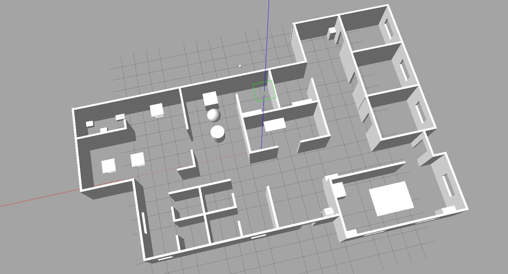

[](https://classroom.udacity.com/nanodegrees/nd209/dashboard/overview)

# Project 1 - Build My World

In this project, I created a Gazebo simulation of an office environment that goes by the name MyOfficeWorld.world. I also built a Gazebo model of a customized differential drive robot and equipped it with Gazebo plugins, for instance, hokuyo laser scanner and a RGB camera sensor. The project also teaches the student to insert plugins, which are nothing but C++ code snippets that interact with the Gazebo world file. This Gazebo world and the robot model was used for all subsequent projects.


## Table of Contents

   * [Requirements](#requirements)
   * [How to use](#how-to-use)
   * [Directory Structure](#directory-structure)
   * [Implementation](#implementation)
   * [Future Work](#future-work)
   * [License](#license)
   * [Contribution](#contribution)


### Requirements
1. Linux OS or a Virtual Machine on Windows/Mac platform, for eg. [Oracle VM VirtualBox](https://www.vmware.com/products/workstation-player/workstation-player-evaluation.html). This project has been developed on Ubuntu 16.04 desktop version of Linux OS using the command line.

2. [ROS](http://wiki.ros.org/kinetic/Installation) kinetic version

   
   
3. [C++](https://www.udacity.com/course/c-for-programmers--ud210)

4. [GitHub](https://www.udacity.com/course/version-control-with-git--ud123)

   
   
5. [Gazebo](http://gazebosim.org/) as the simulation environment

   


### How to use
1. If you do not have an active ROS workspace, you can create one by following the below commands (assuming operating ROS kinetic version is already installed, if not follow these [instructions](http://wiki.ros.org/kinetic/Installation) -
```sh
$ mkdir -p ~/catkin_ws/src
$ cd ~/catkin_ws/
$ catkin_make
```

2. One time Gazebo setup step -
+ [Install](http://gazebosim.org/tutorials?tut=install_ubuntu&cat=install)
```sh
$ curl -sSL http://get.gazebosim.org | sh
```
+ Run
```sh
$ gazebo
```

3. Now that catkin_ws is set up locally on your machine, Clone this repository to your desired path using -
```sh
$ git clone https://github.com/SasmitC/ROS_Udacity_NanoDegree.git
$ cd ROS_Udacity_NanoDegree
```

4. Copy the contents from the 'Project2_Go_Chase_It/catkin_ws' directory, excluding the CMakeLists.txt and package.xml (delete these two files before building the project or modify the relative path directories in these two files), into your '~/catkin_ws' local src directory

5. Build the project using -
```sh
$ cd ~/catkin_ws
$ catkin_make
```

6. Add the following to your .bashrc file, so that you do not need to source the environment while opening a new terminal window each time -
```sh
export GAZEBO_MODEL_PATH=~/catkin_ws/model/MyUdacityOffice
source ~/catkin_ws/devel/setup.bash
```

7. After building the project, launch the gazebo world file - 
```sh
$ cd ~/catkin_ws/world
$ gazebo MyOfficeWorld.world
```

### Directory Structure
```bash
.Project1_Build_My_World
├── catkin_ws
│   ├── build
│   │   ├── ...
│   ├── model
│   │   ├── MyRobot
│   │   │   ├── model.config
│   │   │   ├── model.sdf
│   │   ├── MyUdacityOffice
│   │   │   ├── model.config
│   │   │   ├── model.sdf
│   ├── script
│   │   ├── welcome.cpp
│   ├── world
│   │   ├── MyOfficeWorld.world
└── Readme.md
```

### Implementation
I created my world file and robot model file which I will use for all the subsequent projects throughout this Nanodegree Program.

1. Build a single floor wall structure using the Building Editor tool in Gazebo. Apply several features, colours, and optionally textures to the structure. Make sure there's enough space between the walls for a robot to navigate.
2. Model any object of your choice using the Model Editor tool in Gazebo. Your model links should be connected with joints.
Import your structure and two instances of your model inside an empty Gazebo World.
3. Import several models from the Gazebo online library and implement it in your existing Gazebo world.
4. Write a C++ World Plugin to interact with your world. Your code should display “Welcome to <your>’s World!” message as soon as you launch the Gazebo world file.
  
These are basic tasks to be performed while building a world file of your own.

#### World Files
A **.world** file contains all the entities in the simulated environment. They are robot models, lighting, sensors and other features. You can save the file with a ```sh .world ``` extension.

To launch a .world file enter the following into terminal - 
```sh
$ gazebo <yourworld>.world
```

The **world** file is formatted using the simulation description format or **.sdf** in short. This is how a **SDF word** file template looks like - 

```xml
<?xml version="1.0" ?>
<sdf version="1.5">
  <world name="default">
    <physics type="ode">
      ...
    </physics>

    <scene>
      ...
    </scene>

    <model name="box">
      ...
    </model>

    <model name="sphere">
      ...
    </model>

    <light name="spotlight">
      ...
    </light>

  </world>
</sdf>
```
You can also include a model file inside your **world** file - 
```xml
<include>
  <uri>model://model_file_name</uri>
</include>
```
Furthermore, you can add a plugin for it to interact with gazebo environment -
Add this 
```xml
<plugin name="hello" filename="libhello.so"/>
```
below 
```xml
<world name="default">
```




#### Troubleshooting
The best way to troubleshoot your Gazebo errors against failure to load plugins or its components is by executing the following command in the terminal -
```sh
$ gazebo myworld --verbose
```

### Future Work
Implement multiple models that interact through model plugins inside the Gazebo world. Explore additional features of the Gazebo simulation environment.

### License
MIT License

### Contribution
You may contribute to this project by forking this GitHub repository, creating pull requests or by raising issues.
