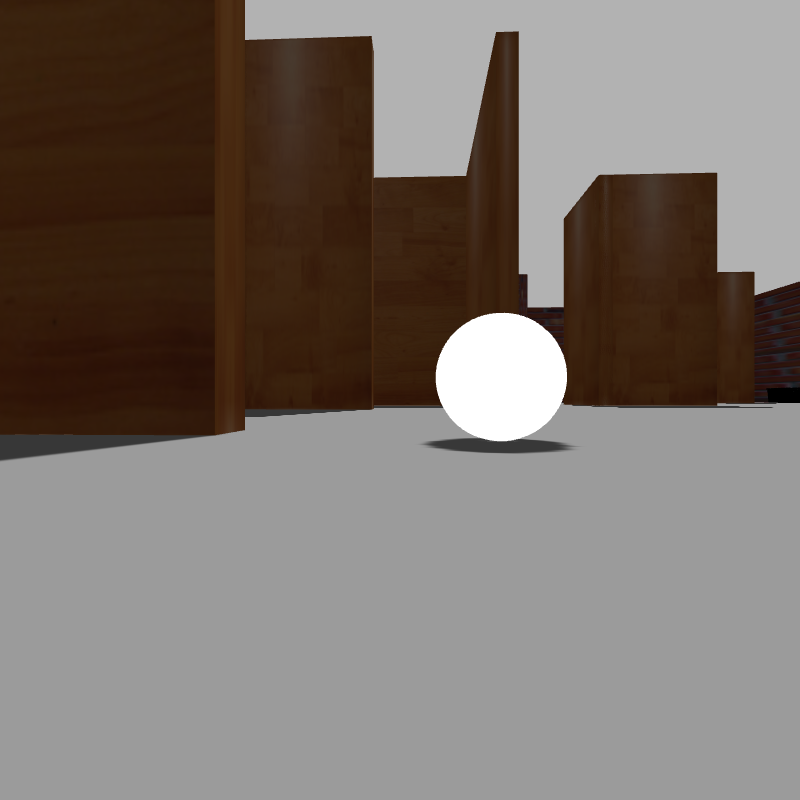
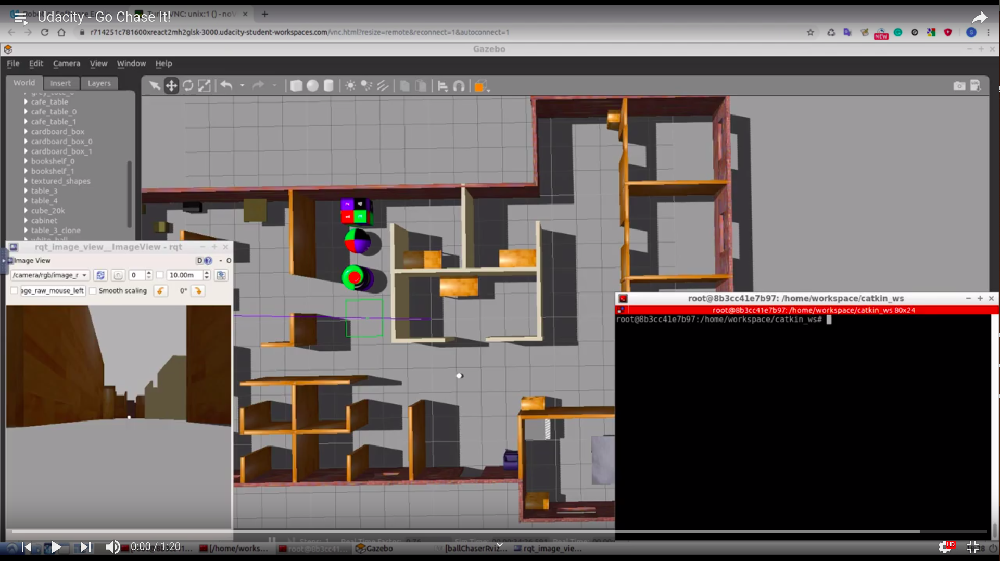

[](https://classroom.udacity.com/nanodegrees/nd209/dashboard/overview)

# Project 2 - Go Chase It!
This project introduces the student to write ROS Nodes in C++ and explore the various powerful features ROS and Gazebo have to offer. This project demonstrates the ability to work with ROS nodes in C++. It implements service and client servers and teaches how to write publisher and subscriber nodes. This project is divided into two major tasks - 
1. House own robot in Gazebo world environment: Learn how to build and customize own robot model using Gazebo Model Editor and then house this robot inside the **MyOfficeWorld.world** world environment created in the previous project.

2. Program the robot to chase a white coloured ball inside the world environment: Learn how to write two ROS Nodes
    + **drive_bot.cpp** - provides a service to navigate the robot through the world environment
    + **process_image.cpp** - subscribes to the camera image, searches and detects a white ball in the robot's field of view. When the ball's position is identified, this node will send a request to the service provided by _drive_bot.cpp_ node which will, in turn, direct the robot towards the white ball.

For a quick demo, jump directly to [The video demonstration of the project](#the-video-demonstration-of-the-project) 

## Table of Contents

   * [Requirements](#requirements)
   * [How to use](#how-to-use)
   * [Directory Structure](#directory-structure)
   * [Implementation](#implementation)
   * [The video demonstration of the project](#the-video-demonstration-of-the-project)
   * [Future Work](#future-work)
   * [License](#license)
   * [Contribution](#contribution)


### Requirements
1. Linux OS or a Virtual Machine for Windows/Mac OS
2. Github
3. C++
4. ROS kinetic version
5. Gazebo and understanding of **SDF** & **URDF** files
6. Rviz
7. Understanding of ROS service, client, publisher and subscriber nodes
8. Understanding of Robotics at a fundamental level
9. Understanding of image processing at a fundamental level

### How to use
1. Set up the robot: Learn how to build customized robot model in the Gazebo simulation environment using **Model Editor**
    + Create a ```urdf``` directory in the ```my_robot``` package
    + Create the robot’s ```my_robot.xacro``` file inside the ```urdf``` directory

2. Launch the robot: Create a launch file that will load the robot model in the Gazebo environment
    + Create a new launch file ```robot_description.launch``` to load the ```URDF``` model file

    ```xml
    <?xml version="1.0"?>
    <launch>

      <!-- send urdf to param server -->
      <param name="robot_description" command="$(find xacro)/xacro --inorder '$(find my_robot)/urdf/my_robot.xacro'" />

    </launch>
    ```

    + Update the ```world.launch``` file created earlier so that Gazebo can load the robot ```URDF``` model. Add the following to the launch file (after <launch>):

    ```xml
      <!-- Robot pose -->
      <arg name="x" default="0"/>
      <arg name="y" default="0"/>
      <arg name="z" default="0"/>
      <arg name="roll" default="0"/>
      <arg name="pitch" default="0"/>
      <arg name="yaw" default="0"/>

      <!-- Launch other relevant files-->
      <include file="$(find my_robot)/launch/robot_description.launch"/>
    ```
    
    + Add the following to the launch file (before ```</launch>```):

    ```xml
      <!-- Find my robot Description-->
      <param name="robot_description" command="$(find xacro)/xacro --inorder '$(find my_robot)/urdf/my_robot.xacro'"/>

      <!-- Spawn My Robot -->
      <node name="urdf_spawner" pkg="gazebo_ros" type="spawn_model" respawn="false" output="screen" 
            args="-urdf -param robot_description -model my_robot 
              -x $(arg x) -y $(arg y) -z $(arg z)
              -R $(arg roll) -P $(arg pitch) -Y $(arg yaw)"/>
    ```

    + Launch the robot
    ```sh
    $ cd ~/catkin_ws/
    $ catkin_make
    $ source devel/setup.bash
    $ roslaunch my_robot world.launch
    ```

3. Add Robot Sensors: 
    Enhance the basic robot model built earlier by adding the camera and lidar sensors
    + Create ```meshes``` directory inside ```my_robot``` directory
    + Now, download this [hokuyo.dae](https://s3-us-west-1.amazonaws.com/udacity-robotics/hokuyo.dae) file and place it under the meshes directory you just created
    + Add the Hokuyo sensor to ```my_robot.xacro```
    + Launch the robot again with the new modifications
    ```sh
    $ cd ~/catkin_ws/
    $ source devel/setup.bash
    $ roslaunch my_robot world.launch
    ```

4. Add Gazebo Plugins:
    Download the [my_robot.gazebo](https://s3-us-west-1.amazonaws.com/udacity-robotics/my_robot.gazebo) file and place it inside the ```urdf``` directory of ```my_robot```

5. Import Plugins:
    + Before you proceed, ensure plugins are correctly imported by your URDF ```my_robot.xacro``` file
    + Import the sensor plugins by adding the following code to the top of the file (immediately before you define the ```robot_footprint``` link):
    ```xml
    <xacro:include filename="$(find my_robot)/urdf/my_robot.gazebo" />
    ```
    Now you are ready to test the sensors in Gazebo environment!

6. Integrate Rviz:
    + Modify ```robot_description.launch``` file by adding following lines after the first ```param```

    ```xml
    <!-- Send fake joint values-->
      <node name="joint_state_publisher" pkg="joint_state_publisher" type="joint_state_publisher">
        <param name="use_gui" value="false"/>
      </node>

      <!-- Send robot states to tf -->
      <node name="robot_state_publisher" pkg="robot_state_publisher" type="robot_state_publisher" respawn="false" output="screen"/>
    ```

7. Modify ```world.launch``` file by adding following after the ```urdf_spawner``` node definition. This will create a node that launches the package ```rviz```. Let's launch it 🚀 
    + Since RViz is a ROS package, it requires roscore. In a terminal spin up roscore:
    ```sh
    $ roscore
    ```
    + In another terminal, run rviz :
    ```sh
    $ rosrun rviz rviz
    ```

8. House the robot in the environment:
    + Edit ```world.launch``` file and add reference to ```MyOfficeWorld.world``` by replacing this line -
    ```xml
    <arg name="world_file" default="$(find my_robot)/worlds/empty.world"/>
    ```
    with
    ```xml
    <arg name="world_file" default="$(find my_robot)/worlds/<yourname>.world"/>
    ```
    + Now launch the package - 
    ```sh
    $ cd ~/catkin_ws/
    $ source devel/setup.bash
    $ roslaunch my_robot world.launch
    ```

9. Set up the ```ball_chaser``` package:
    This package contains two C++ nodes -  ```drive_bot``` and ```process_image```
    + Navigate to the ```src``` directory of your ```catkin_ws``` and create the ```ball_chaser``` package - 
    ```sh
    $ cd ~/catkin_ws/src/
    $ catkin_create_pkg ball_chaser roscpp std_msgs message_generation
    ```
    + Next, create a ```srv``` and a ```launch``` folder, which will further define the structure of your package - 
    ```sh
    $ cd ~/catkin_ws/src/ball_chaser/
    $ mkdir srv
    $ mkdir launch
    ```
    + Build the package - 
    ```sh
    $ cd ~/catkin_ws/
    $ catkin_make
    ```

10. Create and test ```DriveToTarget.srv``` file under the ```srv``` directory of ```ball_chaser```:
    ```
    float64 linear_x
    float64 angular_z
    ---
    string msg_feedback
    ```
    Test it by following - 
    ```sh
    $ cd ~/catkin_ws/src/ball_chaser/
    $ source devel/setup.bash
    $ rossrv show DriveToTarget
    ```
    You should get the response as above in the ```DriveToTarget.srv``` file

11. Create and edit ```drive_bot``` ROS node as found in the directory

12. Edit CMakeLists.txt:
    After you write the server node in C++, you’ll have to add the following dependencies -

    + Add the ```add_compile_options``` for C++ 11 dependency, this step is optional and depends on your code
    + Add the ```add_service_files``` dependency which defines the DriveToTarget.srv file
    + Add the ```generate_messages``` dependency
    + Add ```include_directories``` dependency
    + Add the ```add_executable```, ```target_link_libraries```, and ```add_dependencies``` dependency for your ```drive_bot.cpp``` script

13. Launch the ```drive_bot``` ROS node:
    + Launch the robot inside your world - 
    ```sh
    $ cd ~/catkin_ws/src/ball_chaser/
    $ source devel/setup.bash
    $ roslaunch my_robot world.launch
    ```
    + Run the ```drive_bot``` node -
    ```sh
    $ cd ~/catkin_ws/src/ball_chaser/
    $ source devel/setup.bash
    $ rosrun ball_chaser drive_bot
    ```
    + Request a ball_chaser/command_robot service
    Test the service by requesting different sets of velocities from the terminal.
    Open a new terminal while all the nodes are running and type - 
    ```sh
    $ cd ~/catkin_ws/src/ball_chaser/
    $ source devel/setup.bash

    $ rosservice call /ball_chaser/command_robot "linear_x: 0.5
    angular_z: 0.0"  # This request should drive your robot forward

    $ rosservice call /ball_chaser/command_robot "linear_x: 0.0
    angular_z: 0.5"  # This request should drive your robot left

    $ rosservice call /ball_chaser/command_robot "linear_x: 0.0
    angular_z: -0.5"  # This request should drive your robot right

    $ rosservice call /ball_chaser/command_robot "linear_x: 0.0
    angular_z: 0.0"  # This request should bring your robot to a complete stop
    ```
    + Let us add the ```drive_bot``` node to a launch file. Create a ```ball_chaser.launch``` file under the launch directory of your ```ball_chaser``` package and then copy following to it - 
    ```xml
    <launch>

    <!-- The drive_bot node -->
      <node name="drive_bot" type="drive_bot" pkg="ball_chaser" output="screen">
      </node>

    </launch>
    ```

14. Model the white ball:
    + Open Gazebo simulation -
    ```sh
    $ gazebo # then Edit-> Model Editor
    ```
    + Insert Sphere from **simple shapes**, edit its size to **0.1** both in ```Visual``` and ```Collision```
    + Change colour to **White** by setting all values of **Visual** Ambient, Diffuse, Specular, and Emissive ```RGBA``` to **1**
    + Save the ball model
    + Insert the newly created white ball in the Gazebo world, place it outside the arena randomly and then launch ```MyOfficeWorld.world``` again 
    + Save this configuration as the new ```MyOfficeWorld.world``` with the white ball under ```~/catkin_ws/src/my_robot/worlds``` directory

15. Create ```process_image.cpp``` ROS node:
    This node will analyze the image and request services to drive the robot towards the white ball.
    + Edit CMakeLists.txt:
    In addition to all the dependencies you added earlier for ```drive_bot.cpp```, these are the dependencies that you should add for ```process_image.cpp``` -
        - Add the ```add_executable```
        - Add the ```target_link_libraries```
        - Add the ```add_dependencies```

    + Build the package -
    ```sh
    $ cd ~/catkin_ws/
    $ catkin_make
    ```
    + Launch and test ```process_image```. Add ```process_image``` to ```ball_chaser.launch```
    + Launch ```world.launch```
    ```sh
    $ cd /~/catkin_ws/
    $ source devel/setup.bash
    $ roslaunch my_robot world.launch
    ```
    +  Run ```drive_bot``` and ```process_image``` by executing ```ball_chaser.launch```
    ```sh
    $ cd /~/catkin_ws/
    $ source devel/setup.bash
    $ roslaunch ball_chaser ball_chaser.launch
    ```

16. Visualize: To visualize the robot’s camera images, you can subscribe to camera RGB image topic from RViz. Or you can run the rqt_image_view node -
```sh
$ cd /~/catkin_ws/
$ source devel/setup.bash
$ rosrun rqt_image_view rqt_image_view
```

### Directory Structure
```bash
.Project1_Build_My_World
├── catkin_ws
│   ├── build
│   │   ├── ...
│   ├── devel
│   │   ├── ...
│   ├── src
│   │   ├── ball_chaser
│   │   │   ├── launch
│   │   │   │   ├── ball_chaser.launch
│   │   │   ├── src
│   │   │   │   ├── drive_bot.cpp
│   │   │   │   ├── process_image.cpp
│   │   │   ├── srv
│   │   │   │   ├── DriveToTarget.srv
│   │   │   ├── CMakeLists.txt
│   │   │   ├── package.xml
│   │   ├── my_robot
│   │   │   ├── launch
│   │   │   │   ├── robot_description.launch
│   │   │   │   ├── world.launch
│   │   │   ├── meshes
│   │   │   │   ├── hokuyo.dae
│   │   │   ├── rviz
│   │   │   │   ├── ballChaserRviz.rviz
│   │   │   ├── urdf
│   │   │   │   ├── my_robot.gazebo
│   │   │   │   ├── my_robot.xacro
│   │   │   ├── worlds
│   │   │   │   ├── MyOfficeWorld.world
│   │   │   │   ├── empty.world
│   │   │   ├── CMakeLists.txt
│   │   │   ├── package.xml
└── Readme.md
```

### Implementation
Now place the white ball at different positions in front of the robot and see if the robot is capable of chasing the ball!
You should observe something like the following:

.jpg "Gazebo World View")

.jpg "Gazebo Robot Top View")

.jpg "Gazebo Chasing the Ball")




### The video demonstration of the project:

[](https://youtu.be/WoI3yUCTPGI "Go Chase It!")

_Click on the image above to redirect to Youtube URL_

### Future Work
Implement skid-steer robot designs or robots that can chase balls of any color.

### License
MIT License Copyright (c) 2019 Udacity

### Contribution
You may contribute to this project by forking this GitHub repository, creating pull requests or by raising issues.
