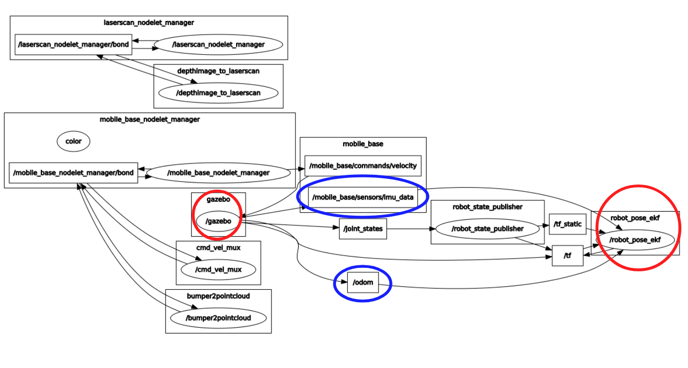
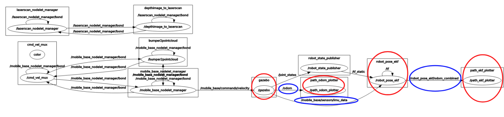
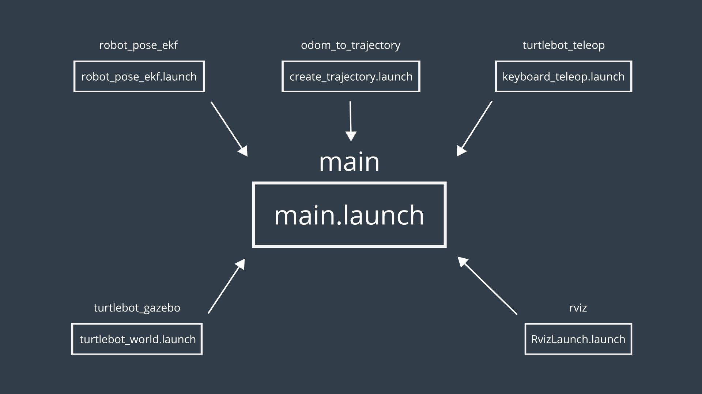
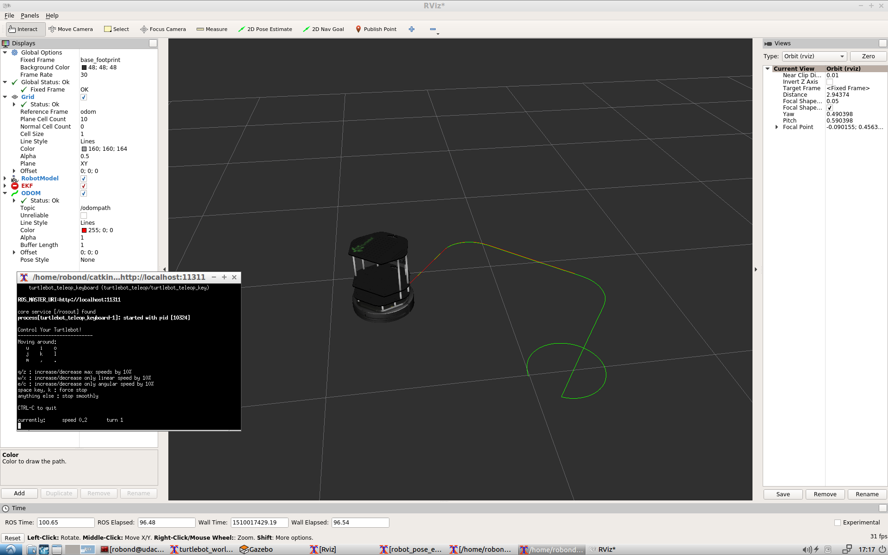

[](https://classroom.udacity.com/nanodegrees/nd209/dashboard/overview)

# Project 3 - Where Am I
Localization is a challenging problem of determining a robot's position and orientation (together known as its pose) in a mapped environment. Usually, this is achieved by implementing a probabilistic algorithm to filter noisy sensor measurements and track the robot's pose. This project introduces two common localization algorithms, namely, the Extended Kalman Filter (EKF) localization and the Monte Carlo localization (MCL), also known as the particle filter algorithm. The multidimensional EKF helps in estimating the state variables comprising of the kinematic parameters for non-linear motion models. Whereas the particle filter uses randomly sampled values of the state known as particles to estimate the robot's state with respect to its environment. Due to the prevailing uncertainty in the sensor measurements, identifying the pose of the robot relative to its environment is prone to errors. This makes localization a non-trivial task. Here, a static environment is used for the purpose of ground truth measurement.

The project starts with a C++ implementation of the Extended Kalman Filter (EKF) and introduces the EKF package in ROS known as the _robot_pose_ekf_. This package combines all the noisy measurements, compares the data generated from the robot's onboard sensors such as the inertial measurement unit (IMU), rotary encoder and vision sensors viz. camera and lidar, filters the noise and removes the uncertainties. It further applies sensor fusion by combining the data from all these sensors in order to better estimate the robot's pose as it moves around. This project also implements the _turtlebot_gazebo_, _odom_to_trajectory_, _turtlebot_teleop_ and the _rviz_ package. It integrates all nodes of the above five packages into a single _launch_ file.

Next, the project implements the Monte Carlo Localization (MCL) algorithm for localizing the robot in its environment. With the particle filter, this algorithm offers potential advantages over the EKF algorithm. THE MCL algorithm involves the motion and sensor update followed by the resampling step. Since the MCL is an iterative process, the algorithm takes the previous belief obtained from randomly generated particles, the actuation input and the sensor measurements and yields a new belief based on the new measurements from the sensors and the prediction step involving the motion model. This project provides an overview of the MCL algorithm in C++. Furthermore, the project implements the Adaptive Monte Carlo Localization (AMCL) package in ROS. Finally, the robot should now be able to localize itself in the simulated environment.


## Table of Contents

   * [Requirements](#requirements)
   * [How to use](#how-to-use)
   * [Directory Structure](#directory-structure)
   * [Implementation](#implementation)
   * [Future Work](#future-work)
   * [License](#license)
   * [Contribution](#contribution)


### Requirements
1. Linux OS or a Virtual Machine for Windows/Mac OS
2. Github
3. C++
4. ROS kinetic version
5. Gazebo
6. Understanding of [conditional probability](https://en.wikipedia.org/wiki/Conditional_probability), [law of total probability](https://en.wikipedia.org/wiki/Law_of_total_probability), [Bayesian statistics](https://en.wikipedia.org/wiki/Bayesian_statistics) and [Bayes' rule](https://en.wikipedia.org/wiki/Bayes%27_theorem).
7. Understanding of [Robotics](https://en.wikibooks.org/wiki/Robotics), state variables and motion model
8. Understanding of [Kalman Filter](https://en.wikipedia.org/wiki/Kalman_filter), [Extended Kalman Filter](https://en.wikipedia.org/wiki/Extended_Kalman_filter) and [Sensor Fusion](https://en.wikipedia.org/wiki/Sensor_fusion)
9. Understanding of [Monte Carlo localization](https://en.wikipedia.org/wiki/Monte_Carlo_localization) and [particle filters](https://en.wikipedia.org/wiki/Particle_filter)


### How to use
1. Set up the ```catkin_ws```: Create the Catkin Workspace - 
```sh
$ mkdir -p /home/workspace/catkin_ws/src
$ cd ~/catkin_ws/src
$ catkin_init_workspace
$ cd ..
$ catkin_make
```

2. Clone, build and launch the ```turtlebot_gazebo``` package:
+ Clone the ```turtlebot_gazebo``` package in to the ```src``` directory created in step #1. Go through [this link](http://wiki.ros.org/turtlebot_gazebo) and its tutorials to get familiar with the package -
```sh
$ cd ~/catkin_ws/src
$ git clone https://github.com/turtlebot/turtlebot_simulator
```
+ Install Dependencies -
```sh
$ cd ~/catkin_ws
$ source devel/setup.bash
$ rosdep -i install turtlebot_gazebo
```
+ Build Package -
```sh
$ catkin_make
$ source devel/setup.bash
```
+ Launch Node - 
```sh
$ roslaunch turtlebot_gazebo turtlebot_world.launch
```
+ Topics -
```sh
$ rostopic list
Or
$ rosrun rqt_graph rqt_graph
```

3. Clone, build and launch the ```robot_pose_ekf``` package:
+ Install the package -
```sh
$ cd ~/catkin_ws/src/
$ git clone http://wiki.ros.org/robot_pose_ekf
```
+ Edit the ```robot_pose_ekf.launch``` file as below -
```xml
<launch>

<node pkg="robot_pose_ekf" type="robot_pose_ekf" name="robot_pose_ekf">
  <param name="output_frame" value="odom_combined"/>
  <param name="base_footprint_frame" value="base_footprint"/>
  <param name="freq" value="30.0"/>
  <param name="sensor_timeout" value="1.0"/>  
  <param name="odom_used" value="true"/>
  <param name="imu_used" value="true"/>
  <param name="vo_used" value="false"/>

  <remap from="imu_data" to="/mobile_base/sensors/imu_data" />    

</node>

</launch>
```
+ Next, build the package -
```sh
$ cd ~/catkin_ws
$ catkin_make
$ source devel/setup.bash
```
+ Now, after the package is installed and built, launch it using -
```sh
$ roslaunch robot_pose_ekf robot_pose_ekf.launch
```
+ A common practice is to visualize the topics by entering the following in the terminal window -
```sh
$ rosrun rqt_graph rqt_graph
```




4. Clone, build and launch the ```odom_to_trajectory``` package:
+ Install the package -
```sh
$ cd ~/catkin_ws/src
$ git clone https://github.com/udacity/odom_to_trajectory
```
+ Build the package -
```sh
$ cd ~/catkin_ws
$ catkin_make
$ source devel/setup.bash
```
+ Launch the node -
```sh
$ roslaunch odom_to_trajectory create_trajectory.launch 
```
+ Visualize the topics -
```sh
$ rosrun rqt_graph rqt_graph
```



5. Clone, install dependencies, build and launch the ```turtlebot_teleop``` package:
+ Clone the package. To know more visit [this link](http://wiki.ros.org/turtlebot_teleop) -
```sh
$ cd ~/catkin_ws/src
$ git clone https://github.com/turtlebot/turtlebot
```

+ Install the package -
```sh
$ cd ~/catkin_ws
$ source devel/setup.bash
$ rosdep -i install turtlebot_teleop
```
+ Build the package -
```sh
$ catkin_make
$ source devel/setup.bash
```
+ Launch the node -
```sh
$ roslaunch turtlebot_teleop keyboard_teleop.launch 
```

6. Edit and launch ```rviz``` package:
+ Launch ```rviz``` -
```sh
$ rosrun rviz rviz
```
+ Edit the rviz configuration -
- Change the Fixed Frame to ```base_footprint```
- Change the Reference Frame to ```odom```
- Add a ```RobotModel```
- Add a ```camera``` and select the ```/camera/rgb/image_raw``` topic
- Add a ```/ekfpath``` topic and change the display name to ```EKFPath```
- Add a ```/odompath``` topic and change the display name to ```OdomPath```
- Change the ```OdomPath``` color to ```red:255;0;0```

+ Save the rviz configuration in ~/catkin_ws/src as ```EKFLab.rviz```

+ Now, kill the rviz terminal!

+ Add the following in the **RvizLaunch.launch** file -
```xml
<launch>
  <!--RVIZ-->
  <node pkg="rviz" type="rviz" name="rviz" args="-d /home/workspace/catkin_ws/src/EKFLab.rviz"/>
</launch>
```
+ Launch ```RvizLaunch.launch``` -
```sh
$ cd ~/catkin_ws/src
$ roslaunch RvizLaunch.launch
```

7. The ```main package```:



+ Create a main package -
```sh
$ cd ~/catkin_ws/src
$ catkin_create_pkg main
```

+ Build the package -
```sh
$ cd ~/catkin_ws
$ catkin_make
```
+ Create and edit the main.launch file -
```sh
$ cd ~/catkin_ws/src/main
$ mkdir launch
$ cd launch 
$ gedit main.launch
```
+ Add the following to the ```main.launch``` -
```xml
<launch>
  
  <!--Robot Pose EKF Package -->
  <!-- The path_ekf_plotter node -->	
  <node name="path_ekf_plotter" type="path_ekf_plotter.py" pkg="odom_to_trajectory">
  </node>
  
  <!-- The path_odom_plotter node -->
  <node name="path_odom_plotter" type="path_odom_plotter.py" pkg="odom_to_trajectory">
  
  <!--RobotPose EKF package-->
  </node>
  <node pkg="robot_pose_ekf" type="robot_pose_ekf" name="robot_pose_ekf">
  <param name="output_frame" value="odom_combined"/>
  <param name="base_footprint_frame" value="base_footprint"/>
  <param name="freq" value="30.0"/>
  <param name="sensor_timeout" value="1.0"/>  
  <param name="odom_used" value="true"/>
  <param name="imu_used" value="true"/>
  <param name="vo_used" value="false"/>
  <remap from="imu_data" to="/mobile_base/sensors/imu_data" />	
  </node>

  <!-- TurleBot Gazzebo-->
  <arg name="world_file"  default="$(env TURTLEBOT_GAZEBO_WORLD_FILE)"/>

  <arg name="base"      value="$(optenv TURTLEBOT_BASE kobuki)"/> <!-- create, roomba -->
  <arg name="battery"   value="$(optenv TURTLEBOT_BATTERY /proc/acpi/battery/BAT0)"/>  <!-- /proc/acpi/battery/BAT0 --> 
  <arg name="gui" default="true"/>
  <arg name="stacks"    value="$(optenv TURTLEBOT_STACKS hexagons)"/>  <!-- circles, hexagons --> 
  <arg name="3d_sensor" value="$(optenv TURTLEBOT_3D_SENSOR kinect)"/>  <!-- kinect, asus_xtion_pro --> 

  <include file="$(find gazebo_ros)/launch/empty_world.launch">
    <arg name="use_sim_time" value="true"/>
    <arg name="debug" value="false"/>
    <arg name="gui" value="$(arg gui)" />
    <arg name="world_name" value="$(arg world_file)"/>
  </include>
  
  <include file="$(find turtlebot_gazebo)/launch/includes/$(arg base).launch.xml">
    <arg name="base" value="$(arg base)"/>
    <arg name="stacks" value="$(arg stacks)"/>
    <arg name="3d_sensor" value="$(arg 3d_sensor)"/>
  </include>
  
  <node pkg="robot_state_publisher" type="robot_state_publisher" name="robot_state_publisher">
    <param name="publish_frequency" type="double" value="30.0" />
  </node>
  
  <!-- Fake laser -->
  <node pkg="nodelet" type="nodelet" name="laserscan_nodelet_manager" args="manager"/>
  <node pkg="nodelet" type="nodelet" name="depthimage_to_laserscan"
        args="load depthimage_to_laserscan/DepthImageToLaserScanNodelet laserscan_nodelet_manager">
    <param name="scan_height" value="10"/>
    <param name="output_frame_id" value="/camera_depth_frame"/>
    <param name="range_min" value="0.45"/>
    <remap from="image" to="/camera/depth/image_raw"/>
    <remap from="scan" to="/scan"/>
  </node>

  <!--RVIZ-->
  <node pkg="rviz" type="rviz" name="rviz" args="-d /home/workspace/catkin_ws/src/EKFLab.rviz"/>
  <!--Use this insted if you are cloning the whole repo in your src-->
  <!--<node pkg="rviz" type="rviz" name="rviz" args="-d /home/workspace/catkin_ws/src/RoboND-EKFLab/EKFLab.rviz"/>-->

  <!--Turtlebot Teleop-->
  <node pkg="turtlebot_teleop" type="turtlebot_teleop_key" name="turtlebot_teleop_keyboard"  output="screen">
    <param name="scale_linear" value="0.5" type="double"/>
    <param name="scale_angular" value="1.5" type="double"/>
    <remap from="turtlebot_teleop_keyboard/cmd_vel" to="cmd_vel_mux/input/teleop"/>
  </node>


</launch>
```
+ Launch the ```main.launch``` file
```sh
$ cd ~/catkin_ws/
$ source devel/setup.bash
$ roslaunch main main.launch
```

8. Instructions for Installing and Running the ```rqt_multiplot``` ROS plugin: Refer [this link](https://github.com/ANYbotics/rqt_multiplot_plugin) for ROS plugin documentation.

+ Open a new terminal and install the ```rqt_multiplot``` -
```sh
$ apt-get install ros-kinetic-rqt -y
$ apt-get install ros-kinetic-rqt-multiplot -y
$ apt-get install libqwt-dev -y
$ rm -rf ~/.config/ros.org/rqt_gui.ini
```
+ Run the ```rqt_plot``` package node -
```sh
$ rosrun rqt_multiplot rqt_multiplot
```


9. Code and observe the MCL in action:
+ Following is the C++ code for Monte Carlo Localization example. Create a mcl.cpp file inside the ```src``` directory and add the following -
```cpp
//Compile with: g++ solution.cpp -o app -std=c++11 -I/usr/include/python2.7 -lpython2.7
#include "src/matplotlibcpp.h" //Graph Library
#include <iostream>
#include <string>
#include <math.h>
#include <stdexcept> // throw errors
#include <random> //C++ 11 Random Numbers
#include <vector>

namespace plt = matplotlibcpp;
using namespace std;

// Landmarks
double landmarks[8][2] = { { 20.0, 20.0 }, { 20.0, 80.0 }, { 20.0, 50.0 },
    { 50.0, 20.0 }, { 50.0, 80.0 }, { 80.0, 80.0 },
    { 80.0, 20.0 }, { 80.0, 50.0 } };

// Map size in meters
double world_size = 100.0;

// Random Generators
random_device rd;
mt19937 gen(rd());

// Global Functions
double mod(double first_term, double second_term);
double gen_real_random();

class Robot {
public:
    Robot()
    {
        // Constructor
        x = gen_real_random() * world_size; // robot's x coordinate
        y = gen_real_random() * world_size; // robot's y coordinate
        orient = gen_real_random() * 2.0 * M_PI; // robot's orientation

        forward_noise = 0.0; //noise of the forward movement
        turn_noise = 0.0; //noise of the turn
        sense_noise = 0.0; //noise of the sensing
    }

    void set(double new_x, double new_y, double new_orient)
    {
        // Set robot new position and orientation
        if (new_x < 0 || new_x >= world_size)
            throw std::invalid_argument("X coordinate out of bound");
        if (new_y < 0 || new_y >= world_size)
            throw std::invalid_argument("Y coordinate out of bound");
        if (new_orient < 0 || new_orient >= 2 * M_PI)
            throw std::invalid_argument("Orientation must be in [0..2pi]");

        x = new_x;
        y = new_y;
        orient = new_orient;
    }

    void set_noise(double new_forward_noise, double new_turn_noise, double new_sense_noise)
    {
        // Simulate noise, often useful in particle filters
        forward_noise = new_forward_noise;
        turn_noise = new_turn_noise;
        sense_noise = new_sense_noise;
    }

    vector<double> sense()
    {
        // Measure the distances from the robot toward the landmarks
        vector<double> z(sizeof(landmarks) / sizeof(landmarks[0]));
        double dist;

        for (int i = 0; i < sizeof(landmarks) / sizeof(landmarks[0]); i++) {
            dist = sqrt(pow((x - landmarks[i][0]), 2) + pow((y - landmarks[i][1]), 2));
            dist += gen_gauss_random(0.0, sense_noise);
            z[i] = dist;
        }
        return z;
    }

    Robot move(double turn, double forward)
    {
        if (forward < 0)
            throw std::invalid_argument("Robot cannot move backward");

        // turn, and add randomness to the turning command
        orient = orient + turn + gen_gauss_random(0.0, turn_noise);
        orient = mod(orient, 2 * M_PI);

        // move, and add randomness to the motion command
        double dist = forward + gen_gauss_random(0.0, forward_noise);
        x = x + (cos(orient) * dist);
        y = y + (sin(orient) * dist);

        // cyclic truncate
        x = mod(x, world_size);
        y = mod(y, world_size);

        // set particle
        Robot res;
        res.set(x, y, orient);
        res.set_noise(forward_noise, turn_noise, sense_noise);

        return res;
    }

    string show_pose()
    {
        // Returns the robot current position and orientation in a string format
        return "[x=" + to_string(x) + " y=" + to_string(y) + " orient=" + to_string(orient) + "]";
    }

    string read_sensors()
    {
        // Returns all the distances from the robot toward the landmarks
        vector<double> z = sense();
        string readings = "[";
        for (int i = 0; i < z.size(); i++) {
            readings += to_string(z[i]) + " ";
        }
        readings[readings.size() - 1] = ']';

        return readings;
    }

    double measurement_prob(vector<double> measurement)
    {
        // Calculates how likely a measurement should be
        double prob = 1.0;
        double dist;

        for (int i = 0; i < sizeof(landmarks) / sizeof(landmarks[0]); i++) {
            dist = sqrt(pow((x - landmarks[i][0]), 2) + pow((y - landmarks[i][1]), 2));
            prob *= gaussian(dist, sense_noise, measurement[i]);
        }

        return prob;
    }

    double x, y, orient; //robot poses
    double forward_noise, turn_noise, sense_noise; //robot noises

private:
    double gen_gauss_random(double mean, double variance)
    {
        // Gaussian random
        normal_distribution<double> gauss_dist(mean, variance);
        return gauss_dist(gen);
    }

    double gaussian(double mu, double sigma, double x)
    {
        // Probability of x for 1-dim Gaussian with mean mu and var. sigma
        return exp(-(pow((mu - x), 2)) / (pow(sigma, 2)) / 2.0) / sqrt(2.0 * M_PI * (pow(sigma, 2)));
    }
};

// Functions
double gen_real_random()
{
    // Generate real random between 0 and 1
    uniform_real_distribution<double> real_dist(0.0, 1.0); //Real
    return real_dist(gen);
}

double mod(double first_term, double second_term)
{
    // Compute the modulus
    return first_term - (second_term)*floor(first_term / (second_term));
}

double evaluation(Robot r, Robot p[], int n)
{
    //Calculate the mean error of the system
    double sum = 0.0;
    for (int i = 0; i < n; i++) {
        //the second part is because of world's cyclicity
        double dx = mod((p[i].x - r.x + (world_size / 2.0)), world_size) - (world_size / 2.0);
        double dy = mod((p[i].y - r.y + (world_size / 2.0)), world_size) - (world_size / 2.0);
        double err = sqrt(pow(dx, 2) + pow(dy, 2));
        sum += err;
    }
    return sum / n;
}
double max(double arr[], int n)
{
    // Identify the max element in an array
    double max = 0;
    for (int i = 0; i < n; i++) {
        if (arr[i] > max)
            max = arr[i];
    }
    return max;
}

void visualization(int n, Robot robot, int step, Robot p[], Robot pr[])
{
    //Draw the robot, landmarks, particles and resampled particles on a graph

    //Graph Format
    plt::title("MCL, step " + to_string(step));
    plt::xlim(0, 100);
    plt::ylim(0, 100);

    //Draw particles in green
    for (int i = 0; i < n; i++) {
        plt::plot({ p[i].x }, { p[i].y }, "go");
    }

    //Draw resampled particles in yellow
    for (int i = 0; i < n; i++) {
        plt::plot({ pr[i].x }, { pr[i].y }, "yo");
    }

    //Draw landmarks in red
    for (int i = 0; i < sizeof(landmarks) / sizeof(landmarks[0]); i++) {
        plt::plot({ landmarks[i][0] }, { landmarks[i][1] }, "ro");
    }

    //Draw robot position in blue
    plt::plot({ robot.x }, { robot.y }, "bo");

    //Save the image and close the plot
    plt::save("./Images/Step" + to_string(step) + ".png");
    plt::clf();
}

int main()
{
    //Practice Interfacing with Robot Class
    Robot myrobot;
    myrobot.set_noise(5.0, 0.1, 5.0);
    myrobot.set(30.0, 50.0, M_PI / 2.0);
    myrobot.move(-M_PI / 2.0, 15.0);
    //cout << myrobot.read_sensors() << endl;
    myrobot.move(-M_PI / 2.0, 10.0);
    //cout << myrobot.read_sensors() << endl;

    // Create a set of particles
    int n = 1000;
    Robot p[n];

    for (int i = 0; i < n; i++) {
        p[i].set_noise(0.05, 0.05, 5.0);
        //cout << p[i].show_pose() << endl;
    }

    //Re-initialize myrobot object and Initialize a measurment vector
    myrobot = Robot();
    vector<double> z;

    //Iterating 50 times over the set of particles
    int steps = 50;
    for (int t = 0; t < steps; t++) {

        //Move the robot and sense the environment afterwards
        myrobot = myrobot.move(0.1, 5.0);
        z = myrobot.sense();

        // Simulate a robot motion for each of these particles
        Robot p2[n];
        for (int i = 0; i < n; i++) {
            p2[i] = p[i].move(0.1, 5.0);
            p[i] = p2[i];
        }

        //Generate particle weights depending on robot's measurement
        double w[n];
        for (int i = 0; i < n; i++) {
            w[i] = p[i].measurement_prob(z);
            //cout << w[i] << endl;
        }

        //Resample the particles with a sample probability proportional to the importance weight
        Robot p3[n];
        int index = gen_real_random() * n;
        //cout << index << endl;
        double beta = 0.0;
        double mw = max(w, n);
        //cout << mw;
        for (int i = 0; i < n; i++) {
            beta += gen_real_random() * 2.0 * mw;
            while (beta > w[index]) {
                beta -= w[index];
                index = mod((index + 1), n);
            }
            p3[i] = p[index];
        }
        for (int k = 0; k < n; k++) {
            p[k] = p3[k];
            //cout << p[k].show_pose() << endl;
        }

        //Evaluate the Error
        cout << "Step = " << t << ", Evaluation = " << evaluation(myrobot, p, n) << endl;

        //####   DON'T MODIFY ANYTHING ABOVE HERE! ENTER CODE BELOW ####

        //Graph the position of the robot and the particles at each step
        visualization(n, myrobot, t, p2, p3);

    } //End of Steps loop

    return 0;
}
```
+ Compile the code using -
```sh
$ cd ~/catkin_ws/src
$ mkdir Images
$ g++ mcl.cpp -o mcl_app -std=c++11 -I/usr/include/python2.7 -lpython2.7
```
+ Run the program (If you get a warning regarding the ```matplotlib``` library, just ignore it) and you should observe the following results -
```sh
$ ./mcl_app
```


### Directory Structure

### Project Overview, Setup Instructions and Implementation of the project
This project utilizes the ROS AMCL package in order to accurately localize a mobile robot inside a map in the Gazebo simulation environment. It can be divided into several tasks such as -

+ To create a ROS package that launches a custom robot model in a custom Gazebo world

+ To utilize the ROS AMCL package and the Tele-Operation / Navigation Stack for localization of the robot

+ To Explore, add, and tune specific parameters corresponding to each package to achieve the best possible localization results

Before moving on with the instructions, it is necessary to install the following packages as well -
```sh
$ sudo apt-get install ros-kinetic-navigation
$ sudo apt-get install ros-kinetic-map-server
$ sudo apt-get install ros-kinetic-move-base
$ sudo apt-get install ros-kinetic-amcl
```

1. 

### Future Work

### License

### Contribution
