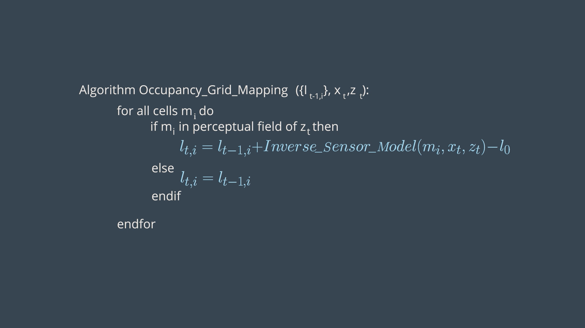
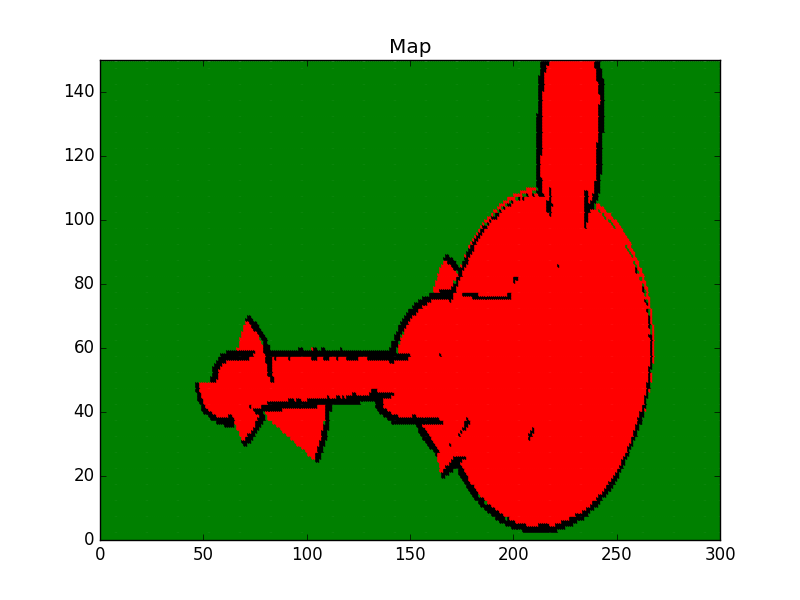

[](https://classroom.udacity.com/nanodegrees/nd209/dashboard/overview)

# Project 4 - Map My World
Welcome to the Mapping and SLAM module. Here, you will learn how the robots build the map of their surrounding environment and perform Simultaneous Localization and Mapping (SLAM). As you recall from the previous project, Localization is the task for the robot to estimate its pose given the map of the environment. However, in many real circumstances, the map may not be known prior either because the area is unexplored or the surroundings change often and the map may not be up to date. That leads us to Mapping, which involves the task of producing the map of the environment given the robot's pose and trajectory. But here's the catch - often in practical and real world problems, you neither have a map nor know the robot's pose. This is when SLAM comes to the rescue!

With limited access only to robot's own movement (odometry) data and sensor measurements, the robot must build the map of its environment while simultaneously localizing itself relative to the map. Although robot mapping sounds similar to localization, it assumes an old path and estimates the configuration of the environment as opposed to a given known map and estimating the environment, as we saw in the previous localization project. While the robot's pose has a finite-dimensional space, namely x and y coordinates and orientation angle theta, the map generally lies in a continuous space and as a result, there are infinitely many variables to describe it. Along with uncertainty in the perception using sensors and the nature of the configuration space, mapping becomes a very challenging task. Here, you will be introduced to the **Occupancy Grid Mapping**.

In SLAM, the robot must build a map of its environment while simultaneously localizing itself relative to this generated map. This task is more challenging than localization and mapping because neither the map nor the robot's pose is provided. Due to the noise present in the sensor measurements, the map and the robot's pose will be uncertain and the errors in the robot's pose estimates and the map will be correlated. SLAM is often called as the _Chicken or the Egg?_ problem! The accuracy of the map depends on the accuracy of the localization and vice versa. But the map is required for localization and the robot's pose is needed for mapping! However, SLAM is fundamental to robotics. Some of the potential applications such as self-driving vehicles, a rover exploring on the surface of Mars, a vacuum cleaner robot etc. all need an accurate SLAM algorithm to perform tasks in an unknown environment.

SLAM algorithms can be categorized as:
+ Extended Kalman Filter SLAM (EKF)
+ Sparse Extended Information Filter (SEIF)
+ Extended Information Form (EIF)
+ **FastSLAM**
+ **GraphSLAM**

In this module, you will be dealing with the **FastSLAM** algorithm, which is based on the particle filter approach combined with a low dimensional EKF to solve the SLAM problem. You will adopt this to _Grid Maps_, resulting in **Grid Based fastSLAM** algorithm. Moreover, you will learn **GraphSLAM**, which uses constraints to represent the relationships between the robot poses and the environment to generate a most likely map given the measurement data. Another flavour of _GraphSLAM_, known as the **Real Time Appearance Based Mapping** or **RTABMAP** will be used later in the project.


## Table of Contents

   * [Requirements](#requirements)
   * [How to use](#how-to-use)
   * [Directory Structure](#directory-structure)
   * [Implementation](#implementation)
   * [Future Work](#future-work)
   * [License](#license)
   * [Contribution](#contribution)

### Requirements

### How to use
1. Code the Occupancy Grid Mapping Algorithm in C++: The robot is equipped with **eight sonar rangefinder sensors**. It navigates around in the environment to generate its map. This mini-prpject has been organized as follows -
    + Data
        - ```measurement.txt```: The measurements from the sonar rangefinder sensors attached to the robot at each time stamp recorded over a period of 413 seconds (timestamp, measurement 1:8).
        - ```poses.txt```: The exact robot poses at each timestamp recorded over a period of 413 seconds (timestamp, x, y, ϴ).
    + Global Functions
        - ```inverseSensorModel()```: To compute ```r``` and ```phi``` and evaluate the three different cases of the algorithm.
        
          
          
        - ```occupancyGridMapping()```: The core algorithm
        
          
          
    + Main Function
        - ```File Scan```: To scan both the measurement and poses files to retrieve the values. At each time stamp, the values are passed to the occupancy grid mapping function.
        - ```Display Map```: To display the generated map after processing all the measurements and poses.
        
    
```cpp
#include <iostream>
#include <math.h>
#include <vector>
#include "src/matplotlibcpp.h" //Graph Library

using namespace std;
namespace plt = matplotlibcpp;

// Sensor characteristic: Min and Max ranges of the beams
double Zmax = 5000, Zmin = 170;
// Defining free cells(lfree), occupied cells(locc), unknown cells(l0) log odds values
double l0 = 0, locc = 0.4, lfree = -0.4;
// Grid dimensions
double gridWidth = 100, gridHeight = 100;
// Map dimensions
double mapWidth = 30000, mapHeight = 15000;
// Robot size with respect to the map 
double robotXOffset = mapWidth / 5, robotYOffset = mapHeight / 3;
// Defining an l vector to store the log odds values of each cell
vector< vector<double> > l(mapWidth/gridWidth, vector<double>(mapHeight/gridHeight));

double inverseSensorModel(double x, double y, double theta, double xi, double yi, double sensorData[])
{
    // Defining Sensor Characteristics
    double Zk, thetaK, sensorTheta;
    double minDelta = -1;
    double alpha = 200, beta = 20;

    //******************Compute r and phi**********************//
    double r = sqrt(pow(xi - x, 2) + pow(yi - y, 2));
    double phi = atan2(yi - y, xi - x) - theta;

    //Scaling Measurement to [-90 -37.5 -22.5 -7.5 7.5 22.5 37.5 90]
    for (int i = 0; i < 8; i++) {
        if (i == 0) {
            sensorTheta = -90 * (M_PI / 180);
        }
        else if (i == 1) {
            sensorTheta = -37.5 * (M_PI / 180);
        }
        else if (i == 6) {
            sensorTheta = 37.5 * (M_PI / 180);
        }
        else if (i == 7) {
            sensorTheta = 90 * (M_PI / 180);
        }
        else {
            sensorTheta = (-37.5 + (i - 1) * 15) * (M_PI / 180);
        }

        if (fabs(phi - sensorTheta) < minDelta || minDelta == -1) {
            Zk = sensorData[i];
            thetaK = sensorTheta;
            minDelta = fabs(phi - sensorTheta);
        }
    }

    //******************Evaluate the three cases**********************//
    if (r > min((double)Zmax, Zk + alpha / 2) || fabs(phi - thetaK) > beta / 2 || Zk > Zmax || Zk < Zmin) {
        return l0;
    }
    else if (Zk < Zmax && fabs(r - Zk) < alpha / 2) {
        return locc;
    }
    else if (r <= Zk) {
        return lfree;
    }
}

void occupancyGridMapping(double Robotx, double Roboty, double Robottheta, double sensorData[])
{
    //******************Code the Occupancy Grid Mapping Algorithm**********************//
    for (int x = 0; x < mapWidth / gridWidth; x++) {
        for (int y = 0; y < mapHeight / gridHeight; y++) {
            double xi = x * gridWidth + gridWidth / 2 - robotXOffset;
            double yi = -(y * gridHeight + gridHeight / 2) + robotYOffset;
            if (sqrt(pow(xi - Robotx, 2) + pow(yi - Roboty, 2)) <= Zmax) {
                l[x][y] = l[x][y] + inverseSensorModel(Robotx, Roboty, Robottheta, xi, yi, sensorData) - l0;
            }
        }
    }
}

void visualization()
{
    //Graph Format
    plt::title("Map");
    plt::xlim(0, (int)(mapWidth / gridWidth));
    plt::ylim(0, (int)(mapHeight / gridHeight));

    // Draw every grid of the map:
    for (double x = 0; x < mapWidth / gridWidth; x++) {
        cout << "Remaining Rows= " << mapWidth / gridWidth - x << endl;
        for (double y = 0; y < mapHeight / gridHeight; y++) {
            if (l[x][y] == 0) { //Green unkown state
                plt::plot({ x }, { y }, "g.");
            }
            else if (l[x][y] > 0) { //Black occupied state
                plt::plot({ x }, { y }, "k.");
            }
            else { //Red free state
                plt::plot({ x }, { y }, "r.");
            }
        }
    }

    //Save the image and close the plot
    plt::save("./Images/Map.png");
    plt::clf();
}

int main()
{
    double timeStamp;
    double measurementData[8];
    double robotX, robotY, robotTheta;

    FILE* posesFile = fopen("Data/poses.txt", "r");
    FILE* measurementFile = fopen("Data/measurement.txt", "r");

    // Scanning the files and retrieving measurement and poses at each timestamp
    while (fscanf(posesFile, "%lf %lf %lf %lf", &timeStamp, &robotX, &robotY, &robotTheta) != EOF) {
        fscanf(measurementFile, "%lf", &timeStamp);
        for (int i = 0; i < 8; i++) {
            fscanf(measurementFile, "%lf", &measurementData[i]);
        }
        occupancyGridMapping(robotX, robotY, (robotTheta / 10) * (M_PI / 180), measurementData);
    }

    // Visualize the map at the final step
    cout << "Wait for the image to generate" << endl;
    visualization();
    cout << "Done!" << endl;

    return 0;
}
```

2. Generate the map: 
    After coding the _Occupancy Grid Mapping algorithm_ in C++ and generating a map 2D vector, its time to visualize the generated map! Basically, you'll plot different cells - occupied, free and unknown cells on a graph to generate the map. Check out this [link](https://github.com/lava/matplotlib-cpp) for more information on the matplotlib C++ library. For information regarding the plot color and shape refer to the LineSpec and LineColor section of the [MATLAB documentation](https://www.mathworks.com/help/matlab/ref/plot.html?ue).
    + Compile the program -
    ```sh
    $ cd Project4_Map_My_World/OccupancyGridMapping/
    $ rm -rf Images/* #Delete the folder content and not the folder itself!
    $ g++ main.cpp -o map_app -std=c++11 -I/usr/include/python2.7 -lpython2.7
    ```
    + Finally run the program -
    ```sh
    $ ./map_app
    ```
    + Now, wait for the program to generate the map and store it in the Project4_Map_My_World/OccupancyGridMapping/Images directory. The generated map should look something like the following -
    + Map Legend:
        -  `Green - Unknown/Undiscovered Zone`
        -  `Red - Free Zone`
        -  `Black - Occupied Zone`
    
    

    For more information on **Occupancy Grid Mapping** refer [this paper](Knowledge_Portal/InTech-Occupancy_grid_maps_for_localization_and_mapping.pdf).

    Mapping with a mobile robot equipped with more than one perception sensor such as LIDAR, RGBD Camera, Radar or Ultrasonic Sensor leads to an enormous size of the  map. But it becomes necessary to combine the data from more than sources into a single map. An intuitive approach maybe to implement Occupancy Grid Mapping Algorithm for individual sensor models. However, this will fail since each sensor has different characteristics and they respond differently to different type of obstacles. The best approach to the _multi sensor fusion_ problem is to build separate maps for each sensor independently of each other and then integrate them. By implementing _De Morgan's Law_ you can combine these individual maps with each cell denoting the combined estimated occupancy values. To obtain the most likely map, the maximum value of each cell in resultant map can be computed. Another approach is perform an OR operation between values of each cell. An illustration of _multi sensor fusion_ to generate a map is shown below -

    ```cpp
    #include <iostream>
    #include <math.h>
    using namespace std;

    const int mapWidth =  2;
    const int mapHeight = 2;

    void sensorFusion(double m1[][mapWidth], double m2[][mapWidth])
    {
        for (int x = 0; x < mapHeight; x++) {
            for (int y = 0; y < mapWidth; y++) {
                double p = 1 - (1 - m1[x][y]) * (1 - m2[x][y]);
                cout << p << " ";
            }
            cout << endl;
        }
    }

    int main()
    {

        double m1[mapHeight][mapWidth] = { { 0.9, 0.6 }, { 0.1, 0.5 } };
        double m2[mapHeight][mapWidth] = { { 0.3, 0.4 }, { 0.4, 0.3 } };
        sensorFusion(m1, m2);

        return 0;
    }
    ```

3. Implement Grid-based FastSLAM Algorithm:
    For a quick read, please refer this concise explanation on [Grid-based FastSLAM Algorithm](https://fjp.at/posts/slam/fastslam/). After going through the nitty-gritty of the algorithm, let us put it to test and simulate the results. Here, you will implement the [```gmapping``` ROS package](http://wiki.ros.org/gmapping) which is based on the **Grid-based FastSLAM Algorithm** to map the environment. ```gmapping``` provides laser and odometry based SLAM and 2D occupancy grid map of the environment. The map gets updated as the robot moves and gathers sensor data. You will learn to deploy a turtlebot inside a willow garage environment.
    
    + Create a catkin_ws in your project directory -
    ```sh
    $ mkdir -p ~/catkin_ws/src
    $ cd ~/catkin_ws/src
    $ catkin_init_workspace
    $ cd ..
    $ catkin_make
    ```
    
    + Clone the ```turtlebot_gazebo``` and ```turtlebot_teleop``` in src directory -
    ```sh
    $ cd ~/catkin_ws/src
    $ git clone https://github.com/turtlebot/turtlebot_simulator
    $ git clone https://github.com/turtlebot/turtlebot
    ```
    
    + Install the package dependencies -
    ```sh
    $ cd ..
    $ source devel/setup.bash
    $ rosdep -i install turtlebot_gazebo
    $ rosdep -i install turtlebot_teleop
    ```
    
    + Build the packages -
    ```sh
    $ catkin_make
    $ source devel/setup.bash
    ```
    
    + Clone the ```gmapping``` package, install its dependencies and build catkin workspace -
    ```sh
    $ cd ~/catkin_ws/src
    $ git clone https://github.com/ros-perception/slam_gmapping
    $ rosdep install gmapping
    $ cd..
    $ catkin_make
    ```
    
    + In terminal #1, deploy the ```turtlebot``` in a willow garage envrironment -
    ```sh
    $ cd ~/catkin_ws
    $ source devel/setup.bash
    $ roslaunch turtlebot_gazebo turtlebot_world.launch world_file:=worlds/willowgarage.world
    ```
    
    + In terminal #2, launch the ```teleop``` node -
    ```sh
    $ cd ~/catkin_ws
    $ source devel/setup.bash
    $ roslaunch turtlebot_teleop keyboard_teleop.launch
    ```
    
    + In terminal #3, run the ```slam_gmapping``` node -
    ```sh
    $ cd ~/catkin_ws
    $ source devel/setup.bash
    $ rosrun gmapping slam_gmapping
    ```
    
    + Run rviz and subscribe to the various published topics to visualize the map-
    ```sh
    $ rosrun rviz rviz
    ```
    Edit the rviz configuration as follows:
        * Change the **Fixed Frame** to ```map```
        * Keep **Reference Frame** as default
        * Add a **RobotModel**
        * Add a **camera** and select the ```/camera/rgb/image_raw``` topic
        * Add a **map** and select the ```/map``` topic
    
    + Save the map of the environment(map.pgm and map.yaml will be generated) -
    ```sh
    $ map_server map_saver -f myMap
    ```
    With the [map_saver](http://wiki.ros.org/map_server), you can load and save the maps.
    
    
    
    


### Directory Structure

### Implementation

### Future Work

### License

### Contribution
