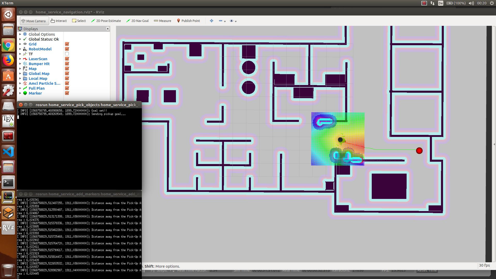

[](https://classroom.udacity.com/nanodegrees/nd209/dashboard/overview)

# Project 5 - Home Service Robot
Up until the previous projects, we dealt with Localization and Mapping as well as SLAM. These are some of the critical tasks for a robot to perceive its surroundings in an unknown environment. Now let us focus on the _Decision Making Aspects of Mobile Robotics_.

**Path Planning** and **Navigation**: It is the calculation of the most optimal and shortest yet feasible path for the robot to reach its destination or goal, given the map and the goal position. While **Path Planning** is a strategic solution to _How Do I Get There?_, it is likely that the robot has to alter its trajectory in real-time as the robot moves towards the goal and encounters obstacles that conflict with the planned path. Thus, **Obstacle Avoidance** is series of tactical decisions the robot must take till it reached its destination goal.
    
In this module you will learn about the _Classical Path Planning Algorithms_, _Probabilistic Path Planning Algorithms_, Code them in C++ and finally, you will integrate all the concepts learnt so far to instruct a home service robot to autonomously pick up and drop off virtual objects in your own simulated environment.
    
There are many potential applications of Path Planning for autonomous robots such as space exploration with rovers, mining, underwater exploration etc. Path Planning is not only limited to robotics but is used in Computer Graphics, Animation, Computational Biology etc.

The outcome of this module include recognizing different types of path planning algorithms, understanding their working, evaluating the suitability of an algorithm for particular applications and implementing the algorithms in C++. You will learn about different approaches to Path Planning - discrete (or combinatorial), sample-based and probabilistic path planning.

**Terminology**:
+ **Complete** - An algorithm is complete if it is able to find a path between the start and the goal when one exists.
+ **Optimal** - An algorithm is optimal if it is able to find the best solution.

For eg. the Bug Algorithm is neither _Complete_ nor _Optimal_.

For a quick demo, jump directly to [The video demonstration of the project](#the-video-demonstration-of-the-project)


## Table of Contents

   * [Requirements](#requirements)
   * [How to use](#how-to-use)
   * [Directory Structure](#directory-structure)
   * [Project Implementation](#project-implementation)
   * [The video demonstration of the project](#the-video-demonstration-of-the-project)
   * [Future Work](#future-work)
   * [License](#license)
   * [Contribution](#contribution)

### Requirements

### How to use
1. Breadth First Search:
    The task is to find the shortest path for a robot moving inside a 5x6 map from start to goal position.
    Given -
    	
	| 0 | 1 | 0 | 0 | 0 | 0 |
	|---|---|---|---|---|---|
	| **0** | **1** | **0** | **0** | **0** | **0** |
	| **0** | **1** | **0** | **0** | **0** | **0** |
	| **0** | **1** | **0** | **0** | **0** | **0** |
	| **0** | **0** | **0** | **1** | **1** | **0** |

	
      * Grid (5x6)
      * Start position: 0,0
      * Goal position:  4,5
      * Direction of movement: Up(-1,0), Left(0,-1), Down(1,0), Right(0,1)
      * Movement Arrows: Up(^), Left(<), Down(v), Right(>)
      * Cost of Movement: 1
        
    + Code in C++ -
    ```cpp
	#include <iostream>
	#include <string.h>
	#include <vector>
	#include <algorithm>
		
	using namespace std;
		
	// Map class
	class Map {
	public:
		const static int mapWidth = 6;
		const static int mapHeight = 5;
		vector<vector<int> > grid = {
			{ 0, 1, 0, 0, 0, 0 },
			{ 0, 1, 0, 0, 0, 0 },
			{ 0, 1, 0, 0, 0, 0 },
			{ 0, 1, 0, 0, 0, 0 },
			{ 0, 0, 0, 1, 1, 0 }
		};
	};
		
	// Planner class
	class Planner : Map {
	public:
		int start[2] = { 0, 0 };
		int goal[2] = { mapHeight - 1, mapWidth - 1 };
		int cost = 1;
		
		string movements_arrows[4] = { "^", "<", "v", ">" };
		
		vector<vector<int> > movements{
			{ -1, 0 },
			{ 0, -1 },
			{ 1, 0 },
			{ 0, 1 }
		};
	};
		
	// Template function to print 2D vectors of any type
	template <typename T>
	void print2DVector(T Vec)
	{
		for (int i = 0; i < Vec.size(); ++i) {
			for (int j = 0; j < Vec[0].size(); ++j) {
				cout << Vec[i][j] << ' ';
			}
			cout << endl;
		}
	}
		
	// Search function will generate the expansions
	void search(Map map, Planner planner)
	{
		// Create a closed 2 array filled with 0s and first element 1
		vector<vector<int> > closed(map.mapHeight, vector<int>(map.mapWidth));
		closed[planner.start[0]][planner.start[1]] = 1;
		
		// Create expand array filled with -1
		vector<vector<int> > expand(map.mapHeight, vector<int>(map.mapWidth, -1));
		
		// Create action array filled with -1
		vector<vector<int> > action(map.mapHeight, vector<int>(map.mapWidth, -1));
		
		// Defined the triplet values
		int x = planner.start[0];
		int y = planner.start[1];
		int g = 0;
		
		// Store the expansions
		vector<vector<int> > open;
		open.push_back({ g, x, y });
		
		// Flags and counters
		bool found = false;
		bool resign = false;
		int count = 0;
		
		int x2;
		int y2;
		
		// While I am still searching for the goal and the problem is solvable
		while (!found && !resign) {
			// Resign if no values in the open list and you can't expand anymore
			if (open.size() == 0) {
				resign = true;
				cout << "Failed to reach a goal" << endl;
			}
			// Keep expanding
			else {
				// Remove triplets from the open list
				sort(open.begin(), open.end());
				reverse(open.begin(), open.end());
				vector<int> next;
				// Stored the poped value into next
				next = open.back();
				open.pop_back();
		
				x = next[1];
				y = next[2];
				g = next[0];
		
				// Fill the expand vectors with count
				expand[x][y] = count;
				count += 1;
		
				// Check if we reached the goal:
				if (x == planner.goal[0] && y == planner.goal[1]) {
					found = true;
					//cout << "[" << g << ", " << x << ", " << y << "]" << endl;
				}
		
				//else expand new elements
				else {
					for (int i = 0; i < planner.movements.size(); i++) {
						x2 = x + planner.movements[i][0];
						y2 = y + planner.movements[i][1];
						if (x2 >= 0 && x2 < map.grid.size() && y2 >= 0 && y2 < map.grid[0].size()) {
							if (closed[x2][y2] == 0 and map.grid[x2][y2] == 0) {
								int g2 = g + planner.cost;
								open.push_back({ g2, x2, y2 });
								closed[x2][y2] = 1;
								action[x2][y2] = i;
							}
						}
					}
				}
			}
		}
		// Print the expansion List
		//print2DVector(expand);
		
		// Find the path with robot orientation
		vector<vector<string> > policy(map.mapHeight, vector<string>(map.mapWidth, "-"));
		
		// Going backward
		x = planner.goal[0];
		y = planner.goal[1];
		policy[x][y] = '*';
		
		while (x != planner.start[0] or y != planner.start[1]) {
			x2 = x - planner.movements[action[x][y]][0];
			y2 = y - planner.movements[action[x][y]][1];
			policy[x2][y2] = planner.movements_arrows[action[x][y]];
			x = x2;
			y = y2;
		}
		
		// Print the path with arrows
		print2DVector(policy);
	}
		
	int main()
	{
		// Instantiate map and planner objects
		Map map;
		Planner planner;
	
		// Search for the expansions
		search(map, planner);
	
		return 0;
	}    
    ```

    + The output of the BFS algorithm should look like -
    
	| v | - | - | - | - | - |
	|---|---|---|---|---|---|
	| v | **-** | **-** | **-** | **-** | **-** |
	| v | **-** | **-** | **-** | **-** | **-** |
	| v | **-** | > | > | > | v |
	| > | > | ^ | **-** | **-** | * |
	
                                    
2. A* Shortest Path: The task is same as above.

    + The modified code for A* search algorithm in C++ -
    ```cpp
	#include <iostream>
	#include <string.h>
	#include <vector>
	#include <algorithm>
		
	using namespace std;
		
	// Map class
	class Map {
	public:
		const static int mapWidth = 6;
		const static int mapHeight = 5;
		vector<vector<int> > grid = {
			{ 0, 1, 0, 0, 0, 0 },
			{ 0, 1, 0, 0, 0, 0 },
			{ 0, 1, 0, 0, 0, 0 },
			{ 0, 1, 0, 0, 0, 0 },
			{ 0, 0, 0, 1, 1, 0 }
		};
		
		vector<vector<int> > heuristic = {
			{ 9, 8, 7, 6, 5, 4 },
			{ 8, 7, 6, 5, 4, 3 },
			{ 7, 6, 5, 4, 3, 2 },
			{ 6, 5, 4, 3, 2, 1 },
			{ 5, 4, 3, 2, 1, 0 }
		};
	};
		
	// Planner class
	class Planner : Map {
	public:
		int start[2] = { 0, 0 };
		int goal[2] = { mapHeight - 1, mapWidth - 1 };
		int cost = 1;
		
		string movements_arrows[4] = { "^", "<", "v", ">" };
		
		vector<vector<int> > movements{
			{ -1, 0 },
			{ 0, -1 },
			{ 1, 0 },
			{ 0, 1 }
		};
	};
		
	// Template function to print 2D vectors of any type
	template <typename T>
	void print2DVector(T Vec)
	{
		for (int i = 0; i < Vec.size(); ++i) {
			for (int j = 0; j < Vec[0].size(); ++j) {
				cout << Vec[i][j] << ' ';
			}
			cout << endl;
		}
	}
	
	// Search function will generate the expansions
	void search(Map map, Planner planner)
	{
		// Create a closed 2 array filled with 0s and first element 1
		vector<vector<int> > closed(map.mapHeight, vector<int>(map.mapWidth));
		closed[planner.start[0]][planner.start[1]] = 1;
		
		// Create expand array filled with -1
		vector<vector<int> > expand(map.mapHeight, vector<int>(map.mapWidth, -1));
		
		// Create action array filled with -1
		vector<vector<int> > action(map.mapHeight, vector<int>(map.mapWidth, -1));
		
		// Defined the quadruplet values
		int x = planner.start[0];
		int y = planner.start[1];
		int g = 0;
		int f = g + map.heuristic[x][y];
		
		// Store the expansions
		vector<vector<int> > open;
		open.push_back({ f, g, x, y });
		
		// Flags and Counts
		bool found = false;
		bool resign = false;
		int count = 0;
		
		int x2;
		int y2;
		
		// While I am still searching for the goal and the problem is solvable
		while (!found && !resign) {
			// Resign if no values in the open list and you can't expand anymore
			if (open.size() == 0) {
				resign = true;
				cout << "Failed to reach a goal" << endl;
			}
			// Keep expanding
			else {
				// Remove quadruplets from the open list
				sort(open.begin(), open.end());
				reverse(open.begin(), open.end());
				vector<int> next;
				// Stored the poped value into next
				next = open.back();
				open.pop_back();
		
				x = next[2];
				y = next[3];
				g = next[1];
		
				// Fill the expand vectors with count
				expand[x][y] = count;
				count += 1;
				
				// Check if we reached the goal:
				if (x == planner.goal[0] && y == planner.goal[1]) {
					found = true;
					//cout << "[" << g << ", " << x << ", " << y << "]" << endl;
				}
		
				//else expand new elements
				else {
					for (int i = 0; i < planner.movements.size(); i++) {
						x2 = x + planner.movements[i][0];
						y2 = y + planner.movements[i][1];
						if (x2 >= 0 && x2 < map.grid.size() && y2 >= 0 && y2 < map.grid[0].size()) {
							if (closed[x2][y2] == 0 and map.grid[x2][y2] == 0) {
								int g2 = g + planner.cost;
								f = g2 + map.heuristic[x2][y2];
								open.push_back({ f, g2, x2, y2 });
								closed[x2][y2] = 1;
								action[x2][y2] = i;
							}
						}
					}
				}
			}
		}
		
		// Print the expansion List
		print2DVector(expand);
	
		// Find the path with robot orientation
		vector<vector<string> > policy(map.mapHeight, vector<string>(map.mapWidth, "-"));
	
		// Going backward
		x = planner.goal[0];
		y = planner.goal[1];
		policy[x][y] = '*';
		
		while (x != planner.start[0] or y != planner.start[1]) {
			x2 = x - planner.movements[action[x][y]][0];
			y2 = y - planner.movements[action[x][y]][1];
			policy[x2][y2] = planner.movements_arrows[action[x][y]];
			x = x2;
			y = y2;
		}
		
		// Print the robot path
		cout << endl; 
		print2DVector(policy);
	}
		
	int main()
	{
		// Instantiate a planner and map objects
		Map map;
		Planner planner;
	
		search(map, planner);
	
		return 0;
	}
    ```

3. Comparison between BFS and A* in terms of the path cost:
    + BFS
    	
		| 0 | -1 | 13 | 17 | -1 | -1 |
		|---|---|---|---|---|---|
		| **1** | **-1** | **10** | **14** | **18** | **-1** |
		| **2** | **-1** | **8** | **11** | **15** | **19** |
		| **3** | **-1** | **7** | **9** | **12** | **16** |
		| **4** | **5** | **6** | **-1** | **-1** | **20** |
		

    + A*
    	
		| 0 | -1 | -1 | -1 | -1 | -1 |
		|---|---|---|---|---|---|
		| **1** | **-1** | **-1** | **-1** | **-1** | **-1** |
		| **2** | **-1** | **-1** | **-1** | **-1** | **-1** |
		| **3** | **-1** | **7** | **8** | **9** | **10** |
		| **4** | **5** | **6** | **-1** | **-1** | **11** |
		

    + Path
    
		| v | - | - | - | - | - |
		|---|---|---|---|---|---|
		| v | **-** | **-** | **-** | **-** | **-** |
		| v | **-** | **-** | **-** | **-** | **-** |
		| v | **-** | > | > | > | v |
		| > | > | ^ | **-** | **-** | * |
		
	                               
    + Result: A* is more efficient since it did not expand in the free space as BFS did. With A* we reached the goal with only 11 expansions compared to 20 with BFS.
    
    + Real World Map Visualization of A* Algorithm: For the Map in the previous project, the path planned using A* Algorithm is shown as below -
    
        
        
    + Map Legend:
    
        -  `Green - Unknown/Undiscovered Zone`
        -  `Red - Free Zone`
        -  `Black - Occupied Zone`        
        -  `Blue - Shortest Path` 
        
	
### Directory Structure
```bash
.Project5_Home_Service_Robot
├── catkin_ws
│   ├── build
│   │   ├── ...
│   ├── devel
│   │   ├── ...
│   ├── src
│   │   ├── add_markers
│   │   │   ├── src
│   │   │   │   ├── add_markers_node.cpp
│   │   │   ├── CMakeLists.txt
│   │   │   ├── package.xml
│   │   ├── home_service
│   │   │   ├── src
│   │   │   │   ├── add_markers_node.cpp
│   │   │   ├── launch
│   │   │   │   ├── home_service.launch
│   │   │   ├── maps
│   │   │   │   ├── map.pgm
│   │   │   │   ├── map.yaml
│   │   │   ├── rviz
│   │   │   │   ├── home_service_navigation.rviz
│   │   │   ├── worlds
│   │   │   │   ├── MyOfficeWorld.world
│   │   │   │   ├── empty.world
│   │   │   ├── CMakeLists.txt
│   │   │   ├── package.xml
│   │   ├── home_service_add_markers
│   │   │   ├── src
│   │   │   │   ├── home_service_add_markers_node.cpp
│   │   │   ├── CMakeLists.txt
│   │   │   ├── package.xml
│   │   ├── home_service_pick_objects
│   │   │   ├── src
│   │   │   │   ├── home_service_pick_objects_node.cpp
│   │   │   ├── CMakeLists.txt
│   │   │   ├── package.xml
│   │   ├── maps
│   │   │   ├── map.pgm
│   │   │   ├── map.yaml
│   │   ├── pgm_map_creator
│   │   │   ├── launch
│   │   │   │   ├── request_publisher.launch
│   │   │   ├── maps
│   │   │   │   ├── map.pgm
│   │   │   ├── msgs
│   │   │   │   ├── collision_map_request.proto
│   │   │   │   ├── CMakeLists.txt
│   │   │   ├── src
│   │   │   │   ├── collision_map_creator.cc
│   │   │   │   ├── request_publisher.cc
│   │   │   ├── world
│   │   │   │   ├── MyOfficeWorld.world
│   │   │   ├── README.md
│   │   │   ├── LICENSE
│   │   │   ├── CMakeLists.txt
│   │   │   ├── package.xml
│   │   ├── pick_objects
│   │   │   ├── src
│   │   │   │   ├── pick_objects_node.cpp
│   │   │   ├── CMakeLists.txt
│   │   │   ├── package.xml
│   │   ├── rvizConfig
│   │   │   ├── home_service_test_navigation.rviz
│   │   ├── scripts
│   │   │   ├── home_service.sh
│   │   │   ├── launch.sh
│   │   │   ├── test_add_markers.sh
│   │   │   ├── test_home_service.sh
│   │   │   ├── test_navigation.sh
│   │   │   ├── test_pick_objects.sh
│   │   │   ├── test_slam.sh
│   │   ├── slam_gmapping
│   │   │   ├── ...
│   │   ├── test_home_service
│   │   │   ├── maps
│   │   │   │   ├── ...
│   │   │   ├── rviz
│   │   │   │   ├── ...
│   │   │   ├── src
│   │   │   │   ├── ...
│   │   │   ├── world
│   │   │   │   ├── building_wall
│   │   │   │   │   ├── model.config
│   │   │   │   │   ├── model.sdf
│   │   │   │   ├── my_world
│   │   │   │   │   ├── test_world.world
│   │   │   ├── CMakeLists.txt
│   │   │   ├── package.xml
│   │   ├── turtlebot
│   │   │   ├── ...
│   │   ├── turtlebot_interactions
│   │   │   ├── ...
│   │   ├── turtlebot_simulator
│   │   │   ├── ...
│   │   ├── CMakeLists.txt
│   │   ├── package.xml
└── Readme.md
```

### Project Implementation
1. Simulation Setup: Here’s the list of the official ROS packages that you will need to grab, and other packages and directories that you’ll need to create at a later stage as you go through the project. Import these packages from the official websites in the ```src``` directory of you ```catkin_ws``` workspace -

	+ [gmapping](http://wiki.ros.org/gmapping): With the ```gmapping_demo.launch``` file, you can easily perform SLAM and build a map of the environment with a robot equipped with laser range finder sensors or RGB-D cameras.
	
	+ [turtlebot_teleop](http://wiki.ros.org/turtlebot_teleop): With the ```keyboard_teleop.launch``` file, you can manually control a robot using keyboard commands.
	
	+ [turtlebot_rviz_launchers](http://wiki.ros.org/turtlebot_rviz_launchers): With the ```view_navigation.launch``` file, you can load a preconfigured rviz workspace. You’ll save a lot of time by launching this file, because it will automatically load the robot model, trajectories, and map for you.
	
	+ [turtlebot_gazebo](http://wiki.ros.org/turtlebot_gazebo): With the ```view_navigation.launch``` file, you can load a preconfigured ```rviz``` workspace. You’ll save a lot of time by launching this file, because it will automatically load the robot model, trajectories, and map for you.
	
	+ map: Inside this directory, you will store your gazebo world file and the map generated from SLAM.

	+ scripts: Inside this directory, you’ll store your shell scripts.

	+ rvizConfig: Inside this directory, you’ll store your customized rviz configuration files.

	+ pick_objects: You will write a node that commands your robot to drive to the pickup and drop off zones.

	+ add_markers: You will write a node that model the object with a marker in ```rviz```.
	
	

2. SLAM Testing: The next task of this project is to autonomously map the environment you designed earlier with the Building Editor in Gazebo. But before you tackle autonomous mapping, it’s important to test if you are able to manually perform SLAM by teleoperating your robot. The goal of this step is to manually test SLAM.

	+ Write a shell script ```test_slam.sh``` that will deploy a turtlebot inside your environment, control it with keyboard commands, interface it with a SLAM package, and visualize the map in ```rviz```.
	
	+ Run and Test -
	
	
	
	
3. Localization and Navigation Testing: The next task of this project is to pick two different goals and test your robot's ability to reach them and orient itself with respect to them. We will refer to these goals as the pickup and drop off zones. This section is only for testing purposes to make sure our robot is able to reach these positions before autonomously commanding it to travel towards them.

	+ We will be using the ROS Navigation stack, which is based on the Dijkstra's, a variant of the Uniform Cost Search algorithm, to plan our robot trajectory from start to goal position. Write a test_navigation.sh shell script that launches these files -
	
	
4. Reaching Multiple Goals: Now, you will write a node that will communicate with the ROS navigation stack and autonomously send successive goals for your robot to reach. As mentioned earlier, the ROS navigation stack creates a path for your robot based on **Dijkstra's** algorithm, a variant of the **Uniform Cost Search** algorithm, while avoiding obstacles on its path.

	+ Here’s the C++ code of this node which sends a single goal for the robot to reach -
	
    ```cpp
	#include <ros/ros.h>
	#include <move_base_msgs/MoveBaseAction.h>
	#include <actionlib/client/simple_action_client.h>

	// Define a client for to send goal requests to the move_base server through a SimpleActionClient
	typedef actionlib::SimpleActionClient<move_base_msgs::MoveBaseAction> MoveBaseClient;

	int main(int argc, char** argv){
  	// Initialize the simple_navigation_goals node
  	ros::init(argc, argv, "simple_navigation_goals");

  	//tell the action client that we want to spin a thread by default
  	MoveBaseClient ac("move_base", true);

  	// Wait 5 sec for move_base action server to come up
  	while(!ac.waitForServer(ros::Duration(5.0))){
    		ROS_INFO("Waiting for the move_base action server to come up");
  	}

  	move_base_msgs::MoveBaseGoal goal;

  	// set up the frame parameters
  	goal.target_pose.header.frame_id = "base_link";
  	goal.target_pose.header.stamp = ros::Time::now();

  	// Define a position and orientation for the robot to reach
  	goal.target_pose.pose.position.x = 1.0;
  	goal.target_pose.pose.orientation.w = 1.0;

   	// Send the goal position and orientation for the robot to reach
  	ROS_INFO("Sending goal");
  	ac.sendGoal(goal);

  	// Wait an infinite time for the results
  	ac.waitForResult();

  	// Check if the robot reached its goal
  	if(ac.getState() == actionlib::SimpleClientGoalState::SUCCEEDED)
    		ROS_INFO("Hooray, the base moved 1 meter forward");
  	else
    		ROS_INFO("The base failed to move forward 1 meter for some reason");

  	return 0;
	}	
    ```
	
	+ You will need to customize above code to create pick up and drop off zones. The ```pick_objects.pp``` code can be found in the [```/Project5_Home_Service_Robot/catkin_ws/src/pick_objects/src/```](catkin_ws/src/pick_objects/src/pick_objects_node.cpp) directory.
	

5. Modeling Virtual Objects: The final task of this project is to model a virtual object with markers in rviz. The virtual object is the one being picked and delivered by the robot, thus it should first appear in its pickup zone, and then in its drop off zone once the robot reaches it. Check out the [tutorial](http://wiki.ros.org/rviz/Tutorials/Markers%3A%20Basic%20Shapes) and go through the documentation to get started.

	Your code should follow this algorithm:
	
	+ Publish the marker at the pickup zone
	+ Pause 5 seconds
	+ Hide the marker
	+ Pause 5 seconds
	+ Publish the marker at the drop off zone
	
	
6. Home Service Robot: Now it’s time to simulate a full home service robot capable of navigating to pick up and deliver virtual objects. To do so, the ```add_markers``` and ```pick_objects``` node should be communicating. Or, more precisely, the **add_markers** node should subscribe to your **odometry** to keep track of your robot pose.

	Modify the add_markers node as follows:

	+ Initially show the marker at the pickup zone
	+ Hide the marker once your robot reaches the pickup zone
	+ Wait 5 seconds to simulate a pickup
	+ Show the marker at the drop off zone once your robot reaches it
	

### The video demonstration of the project:

[](https://youtu.be/HwDrsTUudWY "Home Service Robot")

_Click on the image above to redirect to Youtube URL_


### Future Work
You may add more tasks for the robot to complete in the virtual world.

### License
MIT License

### Contribution
You may contribute to this project by forking this GitHub repository, creating pull requests or by raising issues.
