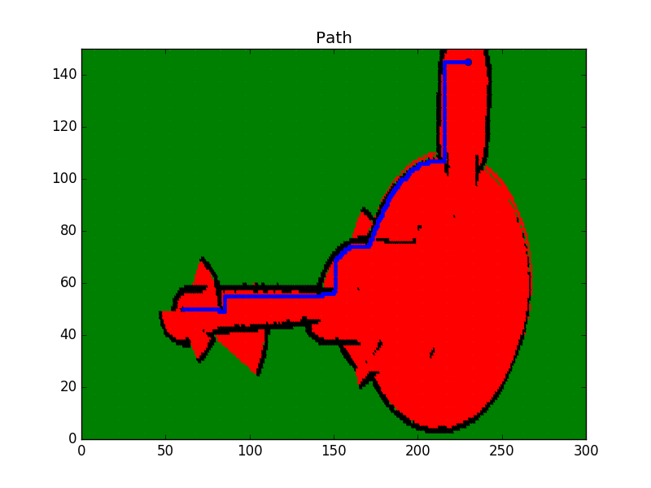

[](https://classroom.udacity.com/nanodegrees/nd209/dashboard/overview)

# Project 5 - Home Service Robot
Up until the previous projects, we dealt with Localization and Mapping as well as SLAM. These are some of the critical tasks for a robot to perceive its surroundings in an unknown environment. Now let us focus on the _Decision Making Aspects of Mobile Robotics_.

**Path Planning** and **Navigation**: It is the calculation of the most optimal and shortest yet feasible path for the robot to reach its destination or goal, given the map and the goal position. While **Path Planning** is a strategic solution to _How Do I Get There?_, it is likely that the robot has to alter its trajectory in real-time as the robot moves towards the goal and encounters obstacles that conflict with the planned path. Thus, **Obstacle Avoidance** is series of tactical decisions the robot must take till it reached its destination goal.
    
In this module you will learn about the _Classical Path Planning Algorithms_, _Probabilistic Path Planning Algorithms_, Code them in C++ and finally, you will integrate all the concepts learnt so far to instruct a home service robot to autonomously pick up and drop off virtual objects in your own simulated environment.
    
There are many potential applications of Path Planning for autonomous robots such as space exploration with rovers, mining, underwater exploration etc. Path Planning is not only limited to robotics but is used in Computer Graphics, Animation, Computational Biology etc.

The outcome of this module include recognizing different types of path planning algorithms, understanding their working, evaluating the suitability of an algorithm for particular applications and implementing the algorithms in C++. You will learn about different approaches to Path Planning - discrete (or combinatorial), sample-based and probabilistic path planning.

**Terminology**:
+ **Complete** - An algorithm is complete if it is able to find a path between the start and the goal when one exists.
+ **Optimal** - An algorithm is optimal if it is able to find the best solution.

For eg. the Bug Algorithm is neither _Complete_ nor _Optimal_.

## Table of Contents

   * [Requirements](#requirements)
   * [How to use](#how-to-use)
   * [Directory Structure](#directory-structure)
   * [Implementation](#implementation)
   * [Future Work](#future-work)
   * [License](#license)
   * [Contribution](#contribution)

### Requirements

### How to use
1. Breadth First Search:
    The task is to find the shortest path for a robot moving inside a 5x6 map from start to goal position.
    + Given -
        - Grid (5x6):               
	
			0 | 1 | 0 | 0 | 0 | 0
                        0 | 1 | 0 | 0 | 0 | 0
                        0 | 1 | 0 | 0 | 0 | 0
                        0 | 1 | 0 | 0 | 0 | 0
                        0 | 0 | 0 | 1 | 1 | 0
        
        - Start position: 0,0
        - Goal position:  4,5
        - Direction of movement: Up(-1,0), Left(0,-1), Down(1,0), Right(0,1)
        - Movement Arrows: Up(^), Left(<), Down(v), Right(>)
        - Cost of Movement: 1
        
    + Code in C++ -
    ```cpp
		#include <iostream>
		#include <string.h>
		#include <vector>
		#include <algorithm>
		
		using namespace std;
		
		// Map class
		class Map {
		public:
			const static int mapWidth = 6;
			const static int mapHeight = 5;
			vector<vector<int> > grid = {
				{ 0, 1, 0, 0, 0, 0 },
				{ 0, 1, 0, 0, 0, 0 },
				{ 0, 1, 0, 0, 0, 0 },
				{ 0, 1, 0, 0, 0, 0 },
				{ 0, 0, 0, 1, 1, 0 }
			};
		};
		
		// Planner class
		class Planner : Map {
		public:
			int start[2] = { 0, 0 };
			int goal[2] = { mapHeight - 1, mapWidth - 1 };
			int cost = 1;
		
			string movements_arrows[4] = { "^", "<", "v", ">" };
		
			vector<vector<int> > movements{
				{ -1, 0 },
				{ 0, -1 },
				{ 1, 0 },
				{ 0, 1 }
			};
		};
		
		// Template function to print 2D vectors of any type
		template <typename T>
		void print2DVector(T Vec)
		{
			for (int i = 0; i < Vec.size(); ++i) {
				for (int j = 0; j < Vec[0].size(); ++j) {
					cout << Vec[i][j] << ' ';
				}
				cout << endl;
			}
		}
		
		// Search function will generate the expansions
		void search(Map map, Planner planner)
		{
			// Create a closed 2 array filled with 0s and first element 1
			vector<vector<int> > closed(map.mapHeight, vector<int>(map.mapWidth));
			closed[planner.start[0]][planner.start[1]] = 1;
		
			// Create expand array filled with -1
			vector<vector<int> > expand(map.mapHeight, vector<int>(map.mapWidth, -1));
		
			// Create action array filled with -1
			vector<vector<int> > action(map.mapHeight, vector<int>(map.mapWidth, -1));
		
			// Defined the triplet values
			int x = planner.start[0];
			int y = planner.start[1];
			int g = 0;
		
			// Store the expansions
			vector<vector<int> > open;
			open.push_back({ g, x, y });
		
			// Flags and counters
			bool found = false;
			bool resign = false;
			int count = 0;
		
			int x2;
			int y2;
		
			// While I am still searching for the goal and the problem is solvable
			while (!found && !resign) {
				// Resign if no values in the open list and you can't expand anymore
				if (open.size() == 0) {
					resign = true;
					cout << "Failed to reach a goal" << endl;
				}
				// Keep expanding
				else {
					// Remove triplets from the open list
					sort(open.begin(), open.end());
					reverse(open.begin(), open.end());
					vector<int> next;
					// Stored the poped value into next
					next = open.back();
					open.pop_back();
		
					x = next[1];
					y = next[2];
					g = next[0];
		
					// Fill the expand vectors with count
					expand[x][y] = count;
					count += 1;
		
					// Check if we reached the goal:
					if (x == planner.goal[0] && y == planner.goal[1]) {
						found = true;
						//cout << "[" << g << ", " << x << ", " << y << "]" << endl;
					}
		
					//else expand new elements
					else {
						for (int i = 0; i < planner.movements.size(); i++) {
							x2 = x + planner.movements[i][0];
							y2 = y + planner.movements[i][1];
							if (x2 >= 0 && x2 < map.grid.size() && y2 >= 0 && y2 < map.grid[0].size()) {
								if (closed[x2][y2] == 0 and map.grid[x2][y2] == 0) {
									int g2 = g + planner.cost;
									open.push_back({ g2, x2, y2 });
									closed[x2][y2] = 1;
									action[x2][y2] = i;
								}
							}
						}
					}
				}
			}
			// Print the expansion List
			//print2DVector(expand);
		
			// Find the path with robot orientation
			vector<vector<string> > policy(map.mapHeight, vector<string>(map.mapWidth, "-"));
		
			// Going backward
			x = planner.goal[0];
			y = planner.goal[1];
			policy[x][y] = '*';
		
			while (x != planner.start[0] or y != planner.start[1]) {
				x2 = x - planner.movements[action[x][y]][0];
				y2 = y - planner.movements[action[x][y]][1];
				policy[x2][y2] = planner.movements_arrows[action[x][y]];
				x = x2;
				y = y2;
			}
		
			// Print the path with arrows
			print2DVector(policy);
		}
		
		int main()
		{
			// Instantiate map and planner objects
			Map map;
			Planner planner;
		
			// Search for the expansions
			search(map, planner);
		
			return 0;
		}    
    ```

    + The output of the BFS algorithm should look like -
    
    
                                    
2. A* Shortest Path: The task is same as above.

    + The modified code for A* search algorithm in C++ -
    ```cpp
		#include <iostream>
		#include <string.h>
		#include <vector>
		#include <algorithm>
		
		using namespace std;
		
		// Map class
		class Map {
		public:
			const static int mapWidth = 6;
			const static int mapHeight = 5;
			vector<vector<int> > grid = {
				{ 0, 1, 0, 0, 0, 0 },
				{ 0, 1, 0, 0, 0, 0 },
				{ 0, 1, 0, 0, 0, 0 },
				{ 0, 1, 0, 0, 0, 0 },
				{ 0, 0, 0, 1, 1, 0 }
			};
		
			vector<vector<int> > heuristic = {
				{ 9, 8, 7, 6, 5, 4 },
				{ 8, 7, 6, 5, 4, 3 },
				{ 7, 6, 5, 4, 3, 2 },
				{ 6, 5, 4, 3, 2, 1 },
				{ 5, 4, 3, 2, 1, 0 }
			};
		};
		
		// Planner class
		class Planner : Map {
		public:
			int start[2] = { 0, 0 };
			int goal[2] = { mapHeight - 1, mapWidth - 1 };
			int cost = 1;
		
			string movements_arrows[4] = { "^", "<", "v", ">" };
		
			vector<vector<int> > movements{
				{ -1, 0 },
				{ 0, -1 },
				{ 1, 0 },
				{ 0, 1 }
			};
		};
		
		// Template function to print 2D vectors of any type
		template <typename T>
		void print2DVector(T Vec)
		{
			for (int i = 0; i < Vec.size(); ++i) {
				for (int j = 0; j < Vec[0].size(); ++j) {
					cout << Vec[i][j] << ' ';
				}
				cout << endl;
			}
		}
		
		// Search function will generate the expansions
		void search(Map map, Planner planner)
		{
			// Create a closed 2 array filled with 0s and first element 1
			vector<vector<int> > closed(map.mapHeight, vector<int>(map.mapWidth));
			closed[planner.start[0]][planner.start[1]] = 1;
		
			// Create expand array filled with -1
			vector<vector<int> > expand(map.mapHeight, vector<int>(map.mapWidth, -1));
		
			// Create action array filled with -1
			vector<vector<int> > action(map.mapHeight, vector<int>(map.mapWidth, -1));
		
			// Defined the quadruplet values
			int x = planner.start[0];
			int y = planner.start[1];
			int g = 0;
			int f = g + map.heuristic[x][y];
		
			// Store the expansions
			vector<vector<int> > open;
			open.push_back({ f, g, x, y });
		
			// Flags and Counts
			bool found = false;
			bool resign = false;
			int count = 0;
		
			int x2;
			int y2;
		
			// While I am still searching for the goal and the problem is solvable
			while (!found && !resign) {
				// Resign if no values in the open list and you can't expand anymore
				if (open.size() == 0) {
					resign = true;
					cout << "Failed to reach a goal" << endl;
				}
				// Keep expanding
				else {
					// Remove quadruplets from the open list
					sort(open.begin(), open.end());
					reverse(open.begin(), open.end());
					vector<int> next;
					// Stored the poped value into next
					next = open.back();
					open.pop_back();
		
					x = next[2];
					y = next[3];
					g = next[1];
		
					// Fill the expand vectors with count
					expand[x][y] = count;
					count += 1;
					
					// Check if we reached the goal:
					if (x == planner.goal[0] && y == planner.goal[1]) {
						found = true;
						//cout << "[" << g << ", " << x << ", " << y << "]" << endl;
					}
		
					//else expand new elements
					else {
						for (int i = 0; i < planner.movements.size(); i++) {
							x2 = x + planner.movements[i][0];
							y2 = y + planner.movements[i][1];
							if (x2 >= 0 && x2 < map.grid.size() && y2 >= 0 && y2 < map.grid[0].size()) {
								if (closed[x2][y2] == 0 and map.grid[x2][y2] == 0) {
									int g2 = g + planner.cost;
									f = g2 + map.heuristic[x2][y2];
									open.push_back({ f, g2, x2, y2 });
									closed[x2][y2] = 1;
									action[x2][y2] = i;
								}
							}
						}
					}
				}
			}
		
			// Print the expansion List
			print2DVector(expand);
		
			// Find the path with robot orientation
			vector<vector<string> > policy(map.mapHeight, vector<string>(map.mapWidth, "-"));
		
			// Going backward
			x = planner.goal[0];
			y = planner.goal[1];
			policy[x][y] = '*';
		
			while (x != planner.start[0] or y != planner.start[1]) {
				x2 = x - planner.movements[action[x][y]][0];
				y2 = y - planner.movements[action[x][y]][1];
				policy[x2][y2] = planner.movements_arrows[action[x][y]];
				x = x2;
				y = y2;
			}
		
			// Print the robot path
			cout << endl; 
			print2DVector(policy);
		}
		
		int main()
		{
			// Instantiate a planner and map objects
			Map map;
			Planner planner;
		
			search(map, planner);
		
			return 0;
		}
    ```

3. Comparison between BFS and A* :
    + BFS
    
    

    + A*
    
    

    + Path
    
    
                                    
    + Result: A* is more efficient since it did not expand in the free space as BFS did. With A* we reached the goal with only 11 expansions compared to 20 with BFS.
    
    + Real World Map Visualization of A* Algorithm: For the Map in the previous project, the path planned is shown as below -
    
        
        
    + Map Legend:
        -  `Green - Unknown/Undiscovered Zone`
        -  `Red - Free Zone`
        -  `Black - Occupied Zone`        
        -  `Blue - Shortest Path` 
        
### Directory Structure

### Implementation

### Future Work

### License

### Contribution
