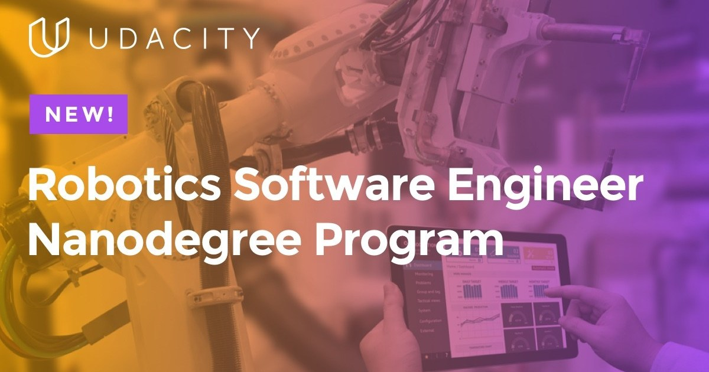

# Robotics Software Engineering Nanodegree - Udacity
This repository comprises of the projects one needs to work on while pursuing the Robotics Software Engineering Nano Degree from Udacity. It is a great kick-starter for ROS beginners and introduces you to ROS &amp; Gazebo fundamentals. Furthermore, it helps a student build on these fundamentals and advance to challenging problems of localization, navigation, mapping, SLAM and path planning algorithms. The programming language used is C++.

My accomplishment:

[Click here to view my Robotics Software Engineer - Udacity Nanodegree Graduation Certificate](UdacityNanoDegree_Chavan_Sasmit.pdf)

Click on the image below to learn more about the program from the makers of this course! 

## Contents:

### [Project 1 - Build My World](https://github.com/SasmitC/ROS_Udacity_NanoDegree/tree/master/Project1_Build_My_World)
The endeavour of this initial project is to familiarise the student with ROS and Gazebo simulation environment, one of the most popular simulation engine used by roboticists across the globe. Here, I have created my custom office environment in Gazebo's Simulation Description File (commonly referred to as SDF), which will be the arena for future projects.

### [Project 2 - Go Chase It!](https://github.com/SasmitC/ROS_Udacity_NanoDegree/tree/master/Project2_Go_Chase_It)
This project introduces the student to create their own ROS Nodes in C++. I built a robot model in the Unified Robot Description Format (URDF). Moreover, I have housed the robot inside my office environment from the previous project and placed a white ball randomly. The robot has to track, chase and navigate towards the white ball using a camera sensor plugin in Gazebo until the white ball lies in its field of view. If the ball does not lie in the field of view, the robot should come to a halt.

### [Project 3 - Where Am I](https://github.com/SasmitC/ROS_Udacity_NanoDegree/tree/master/Project3_Where_Am_I)
This project introduces the student to the Adaptive Monte Carlo Localization package and, in general, the concept of localization used by autonomous robots for perceiving the surroundings with the help of sensor measurements. Gaussian filters are commonly used to estimate the values from the noisy sensor data. This package allows the robot to estimate its position with respect to the known map of the environment. I have successfully created a map of my office environment that will be used in the next projects consequently.

### [Project 4 - Map My World](https://github.com/SasmitC/ROS_Udacity_NanoDegree/tree/master/Project4_Map_My_World)
The goal of this project is to deploy mapping algorithms and localization packages to simultaneously map the surroundings as well as localize the robot in its mapped environment. This project combines the concepts from the previous project on localization. It delves deeper into various Simultaneous Localization and Mapping (SLAM) algorithms. I have mapped my office environment and localized my robot with respect to the generated map.

### [Project 5 - Home Service Robot](https://github.com/SasmitC/ROS_Udacity_NanoDegree/tree/master/Project5_Home_Service_Robot)
This is the final challenge of the Nano Degree. This project applies on all the concepts taught in the previous project lessons and combines them to design an autonomously navigating home service robot. This project introduces the navigation and path planning algorithms and implements the SLAM algorithms from the previous projects. The ultimate goal of this capstone project is to instruct the robot to pick up and deliver virtual items in the simulated office environment.
